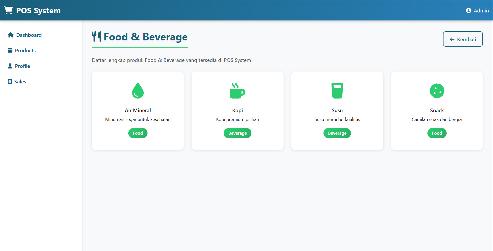

# Laporan Tugas Jobsheet 02 - PWL 2025/2026

## Identitas Mahasiswa
**Nama:** Achmad Daud Roichan  
**NIM:** 244107020005  
**Kelas:** TI-2F  
**Semester:** 2026/2027  

---

## Fitur Aplikasi

### 1. Halaman Home (Dashboard)

Halaman utama yang menampilkan informasi awal website dengan statistik dan quick actions.

**Route:** `/`

**Controller:** `HomeController@index`

**View:** `resources/views/home.blade.php`

**Deskripsi:** Dashboard dengan navigasi lengkap ke semua kategori produk dan fitur utama sistem

---

### 2. Halaman Products

Menampilkan daftar produk berdasarkan kategori dengan menggunakan route prefix.

#### Kategori yang tersedia:

1. **Food & Beverage**
   - Route: `/category/food-beverage`
   - Controller: `CategoryController@foodBeverage`
   - Products: Air Mineral, Kopi, Susu, Snack

2. **Beauty & Health**
   - Route: `/category/beauty-health`
   - Controller: `CategoryController@beautyHealth`
   - Products: Sabun Wajah, Shampo, Vitamin, Obat-obatan

3. **Home Care**
   - Route: `/category/home-care`
   - Controller: `CategoryController@homeCare`
   - Products: Deterjen, Pembersih Lantai, Pengharum Ruangan, Tissue

4. **Baby & Kid**
   - Route: `/category/baby-kid`
   - Controller: `CategoryController@babyKid`
   - Products: Popok Bayi, Susu Formula, Mainan Anak, Pakaian Bayi

---

### 3. Halaman User Profile

Menampilkan profil pengguna dengan route parameter (id dan name).

**Route:** `/user/{id}/name/{name}`

**Contoh:** `/user/1/name/Admin`

**Controller:** `UserController@profile`

**View:** `resources/views/user/profile.blade.php`

**Deskripsi:** Menampilkan informasi profil user dengan dynamic parameter dari URL

---

### 4. Halaman Penjualan (Sales Transaction)

Menampilkan daftar transaksi penjualan POS dengan detail item, harga, dan total.

**Route:** `/sales`

**Controller:** `SalesController@index`

**View:** `resources/views/sales/index.blade.php`

**Deskripsi:** Halaman transaksi yang menampilkan tabel penjualan dengan perhitungan otomatis

---

## Struktur Project

### Controllers
```
app/Http/Controllers/
├── HomeController.php         # Controller untuk halaman home
├── CategoryController.php      # Controller untuk halaman products
├── UserController.php         # Controller untuk halaman user profile
└── SalesController.php        # Controller untuk halaman sales
```

### Routes
```php
// Halaman Home
Route::get('/', [HomeController::class, 'index']);

// Halaman Products dengan route prefix
Route::prefix('category')->group(function () {
    Route::get('/food-beverage', [CategoryController::class, 'foodBeverage']);
    Route::get('/beauty-health', [CategoryController::class, 'beautyHealth']);
    Route::get('/home-care', [CategoryController::class, 'homeCare']);
    Route::get('/baby-kid', [CategoryController::class, 'babyKid']);
});

// Halaman User dengan route parameter
Route::get('/user/{id}/name/{name}', [UserController::class, 'profile']);

// Halaman Penjualan
Route::get('/sales', [SalesController::class, 'index']);
```

### Views
```
resources/views/
├── layout.blade.php              # Layout utama dengan sidebar dan navbar
├── home.blade.php                # View halaman home/dashboard
├── category/
│   ├── food-beverage.blade.php
│   ├── beauty-health.blade.php
│   ├── home-care.blade.php
│   └── baby-kid.blade.php
├── user/
│   └── profile.blade.php
└── sales.blade.php
```

---

## Teknologi yang Digunakan

- **Framework:** Laravel 12.53.0
- **Language:** PHP 8.5.1
- **Database:** SQLite
- **Frontend:** Bootstrap 5.3.0
- **Icons:** Font Awesome 6.4.0
- **Template Engine:** Blade

---

## Screenshot Hasil

Berikut adalah hasil implementasi 4 halaman utama aplikasi POS System:

### 1. Halaman Home (Dashboard)
**URL:** `http://127.0.0.1:8001/`


**Deskripsi:** Halaman utama yang menampilkan welcome message dan informasi tentang fitur-fitur aplikasi. Sidebar menampilkan 4 menu navigasi utama.

---

### 2. Halaman Products (Kategori)
**URL:** `http://127.0.0.1:8001/category/food-beverage`



**Deskripsi:** Halaman kategori produk dengan tampilan grid produk menggunakan Bootstrap cards. Menampilkan product cards dengan icon, nama, deskripsi, dan badge kategori.

---

### 3. Halaman User Profile
**URL:** `http://127.0.0.1:8001/user/1/name/Admin`


**Deskripsi:** Halaman profil pengguna yang menerima parameter dinamis dari URL (id dan name). Menampilkan informasi user dalam format card yang elegan dengan gradient background.

---

### 4. Halaman Penjualan (Sales Transaction)
**URL:** `http://127.0.0.1:8001/sales`


**Deskripsi:** Halaman transaksi penjualan dengan tabel berisi item, harga satuan, quantity, dan total. Terdapat ringkasan pembayaran dengan subtotal, pajak, dan grand total.

---

