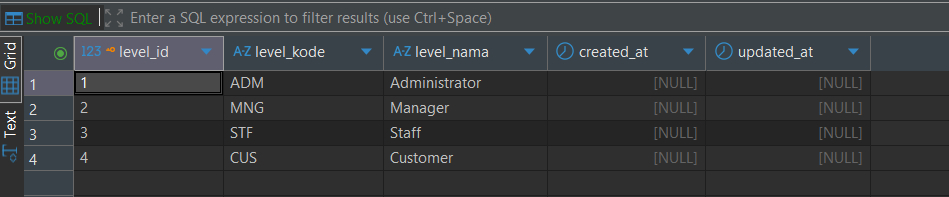
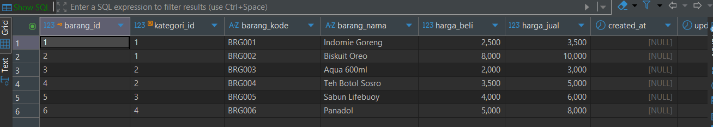
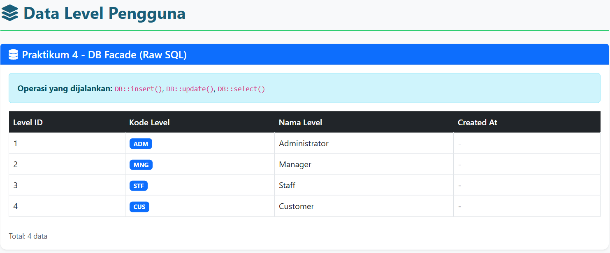
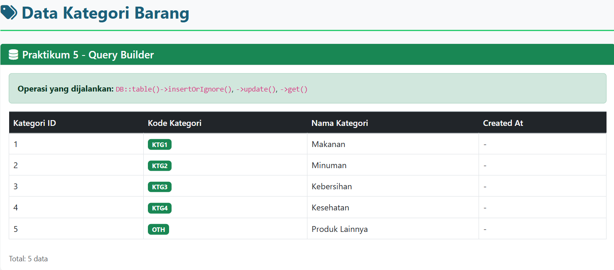
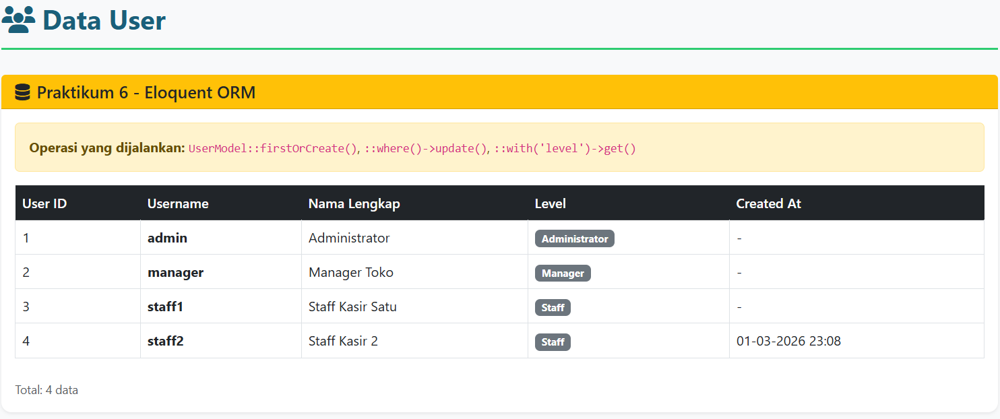

# Laporan Praktikum Jobsheet 03 - PWL 2025/2026

## Identitas Mahasiswa
**Nama:** Achmad Daud Roichan  
**NIM:** 244107020005  
**Kelas:** TI-2F  
**Semester:** 2026/2027  

---

## Praktikum 2.1 - Pembuatan File Migrasi Tanpa Relasi

### Langkah-Langkah

1. Membuat file migrasi untuk tabel `m_level`
```bash
php artisan make:migration create_m_level_table
```

2. Modifikasi file migrasi, menambahkan kolom: `level_id`, `level_kode`, `level_nama`, `timestamps`

3. Membuat tabel `m_kategori` dengan cara yang sama

4. Menjalankan migrasi
```bash
php artisan migrate
```

### Screenshot Hasil:


Hasil: ✅ Tabel `m_level` dan `m_kategori` berhasil dibuat di database

---

## Praktikum 2.2 - Pembuatan File Migrasi Dengan Relasi

### Langkah-Langkah

1. Membuat file migrasi untuk tabel `m_user` dengan foreign key ke `m_level`
```bash
php artisan make:migration create_m_user_table
```

2. Menambahkan foreign key constraint:
```php
$table->foreign('level_id')->references('level_id')->on('m_level');
```

3. Membuat tabel-tabel lainnya dengan relasi:
   - `m_barang` → foreign key ke `m_kategori`
   - `t_penjualan` → foreign key ke `m_user`
   - `t_penjualan_detail` → foreign key ke `t_penjualan` dan `m_barang`

4. Menjalankan migrasi
```bash
php artisan migrate
```

### Screenshot Hasil:


Hasil: ✅ Semua tabel dengan relasi foreign key berhasil dibuat ✅ Relasi antar tabel terbentuk dengan benar

---

## Praktikum 2.3 - Membuat File Seeder

### Langkah-Langkah

1. Membuat file seeder:
```bash
php artisan make:seeder LevelSeeder
php artisan make:seeder KategoriSeeder
php artisan make:seeder UserSeeder
php artisan make:seeder BarangSeeder
php artisan make:seeder PenjualanSeeder
php artisan make:seeder PenjualanDetailSeeder
```

2. Mengisi data di setiap seeder menggunakan `DB::table()->insert()`

3. Mendaftarkan semua seeder di `DatabaseSeeder.php`

4. Menjalankan seeder:
```bash
php artisan db:seed
```

| No | Tabel | Jumlah Record | Keterangan |
|----|-------|---------------|------------|
| 1 | m_level | 3 | Administrator, Manager, Staff |
| 2 | m_kategori | 4 | Makanan, Minuman, Kebersihan, Kesehatan |
| 3 | m_user | 3 | admin, manager, staff1 |
| 4 | m_barang | 6 | 6 produk dari berbagai kategori |
| 5 | t_penjualan | 3 | 3 transaksi penjualan |
| 6 | t_penjualan_detail | 7 | 7 detail item transaksi |

### Screenshot Hasil:


Hasil: ✅ Semua seeder berhasil dibuat dan dijalankan

---

## Praktikum 4 - Implementasi DB Facade

### Langkah-Langkah

1. Membuat `LevelController`
```bash
php artisan make:controller LevelController
```

2. Menambahkan route
```php
Route::get('/level', [LevelController::class, 'index']);
```

3. Insert data dengan `DB::insert()`
```php
DB::insert(
    'insert into m_level(level_kode, level_nama) values(?, ?) ON CONFLICT (level_kode) DO NOTHING',
    ['CUS', 'Pelanggan']
);
```

4. Update data dengan `DB::update()`
```php
DB::update(
    'update m_level set level_nama = ? where level_kode = ?',
    ['Customer', 'CUS']
);
```

5. Select data dengan `DB::select()`
```php
$data = DB::select('select * from m_level');
return view('level.index', ['data' => $data]);
```

6. Membuat view `resources/views/level/index.blade.php`

### Screenshot Hasil:


Hasil: ✅ Operasi INSERT, UPDATE berhasil dilakukan ✅ Data berhasil ditampilkan di view

---

## Praktikum 5 - Implementasi Query Builder

### Langkah-Langkah

1. Membuat `KategoriController`
```bash
php artisan make:controller KategoriController
```

2. Menambahkan route
```php
Route::get('/kategori', [KategoriController::class, 'index']);
```

3. Insert data
```php
DB::table('m_kategori')->insertOrIgnore([
    'kategori_kode' => 'OTH',
    'kategori_nama' => 'Lainnya',
]);
```

4. Update data
```php
DB::table('m_kategori')
    ->where('kategori_kode', 'OTH')
    ->update(['kategori_nama' => 'Produk Lainnya']);
```

5. Select data
```php
$data = DB::table('m_kategori')->get();
return view('kategori.index', ['data' => $data]);
```

6. Membuat view `resources/views/kategori/index.blade.php`

### Screenshot Hasil:


Hasil: ✅ Operasi CRUD berhasil dilakukan dengan Query Builder ✅ Data berhasil ditampilkan di view

---

## Praktikum 6 - Implementasi Eloquent ORM

### Langkah-Langkah

1. Menggunakan `UserModel` yang sudah dibuat
```php
protected $table = 'm_user';
protected $primaryKey = 'user_id';
protected $fillable = ['level_id', 'username', 'nama_lengkap', 'password'];
```

2. Menambahkan route
```php
Route::get('/user', [UserController::class, 'index']);
```

3. Insert data dengan Eloquent
```php
UserModel::firstOrCreate(
    ['username' => 'staff2'],
    ['level_id' => 3, 'nama_lengkap' => 'Staff Kasir Dua', 'password' => Hash::make('password123')]
);
```

4. Update data dengan Eloquent
```php
UserModel::where('username', 'staff2')
    ->update(['nama_lengkap' => 'Staff Kasir 2']);
```

5. Select dengan relasi (Eager Loading)
```php
$data = UserModel::with('level')->get();
return view('user.index', ['data' => $data]);
```

6. Membuat view `resources/views/user/index.blade.php`

### Screenshot Hasil:


Hasil: ✅ Data berhasil di-insert, update, dan ditampilkan menggunakan Eloquent ORM

---

## Konfigurasi Database

**Database:** PostgreSQL (DBeaver)  
**DB_CONNECTION:** pgsql  
**DB_HOST:** 127.0.0.1  
**DB_PORT:** 5432  
**DB_DATABASE:** PWL_POS  
**DB_USERNAME:** postgres  

> **Catatan:** Extension `pdo_pgsql` dan `pgsql` diaktifkan secara manual di `php.ini` Laragon karena tidak aktif secara default.

---

## Teknologi yang Digunakan

- **Framework:** Laravel 12
- **Language:** PHP 8.5.1
- **Database:** PostgreSQL 15 (via DBeaver)
- **PHP Extension:** pdo_pgsql, pgsql
- **Tools:** Laragon, DBeaver


---
