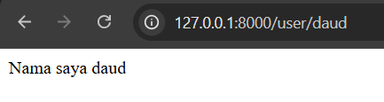
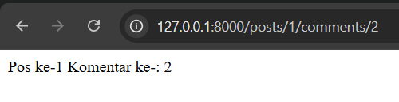
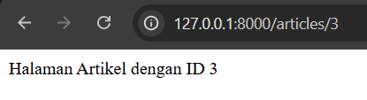
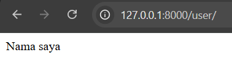
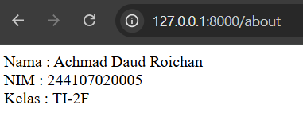
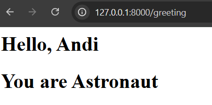

# LAPORAN PRAKTIKUM PEMROGRAMAN WEB LANJUT (PWL) - WEEK 2

**Nama:** Achmad Daud Roichan  
**NIM:** 244107020005  
**Kelas:** TI-2F  
**Semester:** 2026/2027


## Praktikum 1 - Routing

```php
Route::get('/user/{name}', function ($name) {
    return 'Nama saya ' . $name;
});
```

**Screenshot:**  


**Pengamatan:** Parameter berhasil ditangkap dari URL.

---

### Route Posts Comments

```php
Route::get('/posts/{post}/comments/{comment}', function ($postId, $commentId) {
    return 'Pos ke-' . $postId . " Komentar ke-: " . $commentId;
});
```

**Screenshot:**  


**Pengamatan:** Route dapat menangkap multiple parameter dari URL.

---

### Membuat Route Articles dengan ID

```php
Route::get('/articles/{id}', function ($id) {
    return 'Halaman Artikel dengan ID ' . $id;
});
```

**Screenshot:**  


**Pengamatan:** Route dapat menampilkan halaman artikel sesuai dengan ID yang dikirim.

---

### Optional Parameters

```php
Route::get('/user/{name?}', function ($name = null) {
    return 'Nama saya ' . $name;
});
```

**Screenshot:**  


**Pengamatan:** Route dapat diakses dengan atau tanpa parameter.

---

### Route Names & Redirect

```php
Route::get('/user/profile', function () {
    return 'Halaman Profile User';
})->name('profile');

Route::redirect('/here', '/about');
```

**Screenshot About Route:**  


**Pengamatan:** Named routes mempermudah referensi, redirect routes mengarahkan ke URL lain.

---

### View Routes

```php
Route::view('/welcome', 'welcome');
```

**Pengamatan:** View routes menampilkan view langsung tanpa controller.

---

## Praktikum 2 - Controller

### PageController - Modifikasi Route dengan Controller

```php
class PageController extends Controller
{
    public function index() {
        return 'Selamat Datang';
    }

    public function about() {
        return 'Nama : Achmad Daud Roichan <br> NIM : 244107020005 <br> Kelas : TI-2F';
    }

    public function articles($id) {
        return 'Halaman Artikel dengan ID ' . $id;
    }
}
```

**Pengamatan:** Menggunakan controller membuat route lebih terorganisir.

---

### Single Action Controllers

```php
class HomeController extends Controller
{
    public function index() {
        return 'Selamat Datang';
    }
}

class AboutController extends Controller
{
    public function about() {
        return 'Nama : Achmad Daud Roichan <br> NIM : 244107020005 <br> Kelas : TI-2F';
    }
}

class ArticleController extends Controller
{
    public function articles($id) {
        return 'Halaman Artikel dengan ID ' . $id;
    }
}
```

**Pengamatan:** Single Action Controller membuat kode lebih modular.

---

### Resource Controller - PhotoController

```bash
php artisan make:controller PhotoController --resource
```

**Methods yang di-generate:**
- `index()`, `create()`, `store()`, `show()`, `edit()`, `update()`, `destroy()`

```php
Route::resource('photos', PhotoController::class);
```

**Pengamatan:** Resource controller otomatis membuat 7 routes untuk CRUD.

#### Route Resource dengan Only

```php
Route::resource('photos', PhotoController::class)->only(['index', 'show']);
```

#### Route Resource dengan Except

```php
Route::resource('photos', PhotoController::class)->except(['create', 'store', 'update', 'destroy']);
```

---

## Praktikum 3 - View

### Membuat View hello.blade.php

```html
<html>
<body>
    <h1>Hello, {{ $name }}</h1>
</body>
</html>
```

**Pengamatan:** File view menggunakan sintaks Blade untuk menampilkan variabel.

---

### Menampilkan View melalui Route

```php
Route::get('/greeting', function () {
    return view('hello', ['name' => 'Andi']);
});
```

**Pengamatan:** Helper function `view()` digunakan untuk menampilkan view dengan data.

---

### View dalam Direktori

```php
Route::get('/greeting', function () {
    return view('blog.hello', ['name' => 'Andi']);
});
```

**Pengamatan:** Dot notation digunakan untuk mereferensikan file view dalam subdirectory.

---

### Menampilkan View dari Controller

```php
class WelcomeController extends Controller
{
    public function greeting() {
        return view('blog.hello', ['name' => 'Andi']);
    }
}
```

```php
Route::get('/greeting', [WelcomeController::class, 'greeting']);
```

**Pengamatan:** Logika view dapat dipisahkan ke controller untuk organisasi kode yang lebih baik.

---

### Meneruskan Data ke View dengan Method with()

```php
public function greeting() {
    return view('blog.hello')
        ->with('name', 'Andi')
        ->with('occupation', 'Astronaut');
}
```

```html
<html>
<body>
    <h1>Hello, {{ $name }}</h1>
    <h1>You are {{ $occupation }}</h1>
</body>
</html>
```

**Screenshot:**  


**Pengamatan:** Method `with()` memungkinkan passing data ke view dengan cara yang lebih readable.

---

Untuk proyek **POS System** dengan implementasi fitur yang lebih lengkap, lihat:
👉 **[POS Week-02 README](../POS%20week-02/README.md)** 
---

