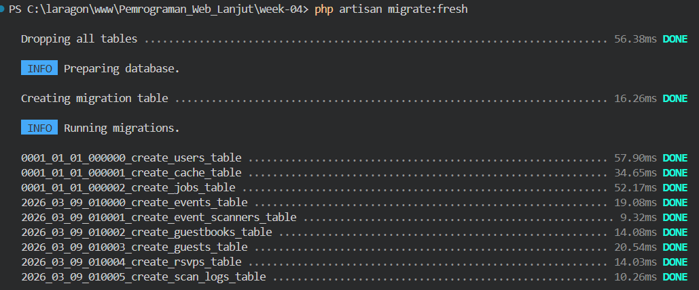
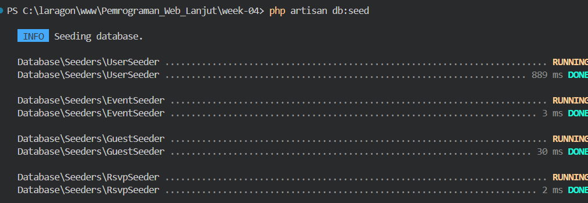
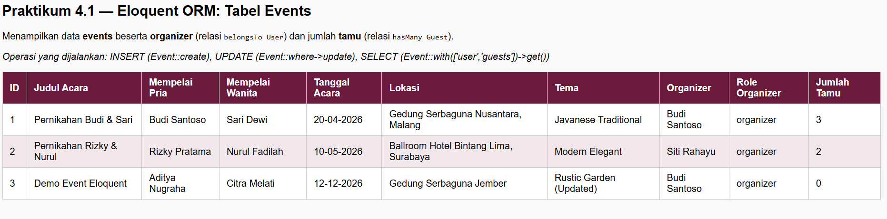
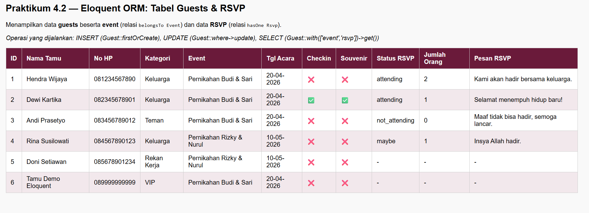

# Laporan Praktikum Jobsheet 04 - Eloquent ORM

## Identitas Mahasiswa
**Nama:** Achmad Daud Roichan  
**NIM:** 244107020005  
**Kelas:** TI-2F  
**Semester:** 2026/2027  

---

## Studi Kasus: WedBook
Aplikasi manajemen undangan pernikahan berbasis Laravel Eloquent ORM dengan ERD:
- **users** → organizer dan scanner
- **events** → data pernikahan (belongsTo users)
- **event_scanners** → pivot event & scanner
- **guests** → tamu undangan (belongsTo events)
- **rsvps** → konfirmasi kehadiran (belongsTo guests)
- **guestbooks** → pesan ucapan (belongsTo events)
- **scan_logs** → log scan QR (belongsTo guests, belongsTo users)

---

## Praktikum 4.1 - Membuat Model Eloquent

### Langkah-Langkah

1. Membuat migration untuk semua tabel WedBook
```bash
php artisan make:migration create_events_table
php artisan make:migration create_event_scanners_table
php artisan make:migration create_guestbooks_table
php artisan make:migration create_guests_table
php artisan make:migration create_rsvps_table
php artisan make:migration create_scan_logs_table
```

2. Mendefinisikan struktur tabel sesuai ERD di setiap migration

3. Menjalankan migrasi
```bash
php artisan migrate:fresh
```

4. Membuat Model untuk setiap tabel dengan relasi Eloquent:

**Event.php** — relasi `belongsTo User`, `hasMany Guest`, `hasMany Guestbook`, `hasMany EventScanner`
```php
public function user(): BelongsTo
{
    return $this->belongsTo(User::class, 'user_id');
}

public function guests(): HasMany
{
    return $this->hasMany(Guest::class, 'event_id');
}
```

**Guest.php** — relasi `belongsTo Event`, `hasOne Rsvp`, `hasMany ScanLog`
```php
public function event(): BelongsTo
{
    return $this->belongsTo(Event::class, 'event_id');
}

public function rsvp(): HasOne
{
    return $this->hasOne(Rsvp::class, 'guest_id');
}
```

**User.php** — tambah kolom `role` (admin/organizer/scanner) dan relasi `hasMany Event`, `hasMany ScanLog`

### Screenshot Hasil:


Hasil: ✅ Semua tabel WedBook berhasil dibuat ✅ Relasi antar model terdefinisi dengan benar

---

## Praktikum 4.2 - Seeder dengan Eloquent

### Langkah-Langkah

1. Membuat seeder untuk setiap tabel
```bash
# dibuat secara manual di database/seeders/
```

2. Mengisi data menggunakan `Model::insert()` dan `Hash::make()` untuk password

3. Mendaftarkan semua seeder di `DatabaseSeeder.php`
```php
$this->call([
    UserSeeder::class,
    EventSeeder::class,
    GuestSeeder::class,
    RsvpSeeder::class,
]);
```

4. Menjalankan seeder
```bash
php artisan db:seed
```

| No | Tabel | Jumlah Record | Keterangan |
|----|-------|---------------|------------|
| 1 | users | 4 | 1 admin, 2 organizer, 1 scanner |
| 2 | events | 2 | 2 event pernikahan |
| 3 | guests | 5 | 3 tamu event 1, 2 tamu event 2 |
| 4 | rsvps | 4 | 4 konfirmasi RSVP |

### Screenshot Hasil:


Hasil: ✅ Semua data berhasil di-seed ke database WedBook

---

## Praktikum 4.3 - Operasi CRUD dengan Eloquent ORM (Events)

### Langkah-Langkah

1. Membuat `EventController`

2. Menambahkan route
```php
Route::get('/event', [EventController::class, 'index']);
```

3. **INSERT** data dengan Eloquent `create()`
```php
Event::create([
    'user_id'       => $organizer->id,
    'title'         => 'Demo Event Eloquent',
    'slug'          => 'pernikahan-demo-eloquent',
    'groom_name'    => 'Aditya Nugraha',
    'bride_name'    => 'Citra Melati',
    'event_date'    => '2026-12-12',
    'location_name' => 'Gedung Serbaguna Jember',
    'theme'         => 'Rustic Garden',
]);
```

4. **UPDATE** data dengan Eloquent `where()->update()`
```php
Event::where('slug', 'pernikahan-demo-eloquent')
    ->update(['theme' => 'Rustic Garden (Updated)']);
```

5. **SELECT** dengan Eager Loading relasi `user` (BelongsTo) dan `guests` (HasMany)
```php
$events = Event::with(['user', 'guests'])->get();
```

6. Membuat view `resources/views/event/index.blade.php` yang menampilkan:
   - Data event + nama organizer dari relasi `user`
   - Jumlah tamu dari relasi `guests->count()`

### Screenshot Hasil:


Hasil: ✅ INSERT, UPDATE, SELECT dengan Eager Loading berhasil ✅ Relasi `belongsTo` dan `hasMany` berjalan

---

## Praktikum 4.4 - Operasi CRUD dengan Eloquent ORM (Guests & RSVP)

### Langkah-Langkah

1. Membuat `GuestController`

2. Menambahkan route
```php
Route::get('/guest', [GuestController::class, 'index']);
```

3. **INSERT** data dengan `firstOrCreate()` (insert jika belum ada)
```php
Guest::firstOrCreate(
    ['qr_token' => 'demo-qr-token-eloquent'],
    [
        'event_id'        => $event->id,
        'name'            => 'Tamu Demo Eloquent',
        'phone'           => '089999999999',
        'category'        => 'Teman',
        'checkin_status'  => false,
        'souvenir_status' => false,
    ]
);
```

4. **UPDATE** data
```php
Guest::where('qr_token', 'demo-qr-token-eloquent')
    ->update(['category' => 'VIP']);
```

5. **SELECT** dengan Eager Loading relasi `event` (BelongsTo) dan `rsvp` (HasOne)
```php
$guests = Guest::with(['event', 'rsvp'])->get();
```

6. Membuat view `resources/views/guest/index.blade.php` yang menampilkan:
   - Data tamu + nama event dari relasi `event`
   - Status RSVP + pesan dari relasi `rsvp` (HasOne)

### Screenshot Hasil:


Hasil: ✅ `firstOrCreate()` berhasil ✅ Relasi `belongsTo` dan `hasOne` berjalan dengan Eager Loading

---

## Ringkasan Relasi Eloquent yang Digunakan

| Relasi | Model | Ke Model | Keterangan |
|--------|-------|----------|------------|
| `belongsTo` | Event | User | Event dimiliki satu organizer |
| `hasMany` | Event | Guest | Event punya banyak tamu |
| `hasMany` | Event | Guestbook | Event punya banyak pesan buku tamu |
| `belongsTo` | Guest | Event | Tamu terdaftar di satu event |
| `hasOne` | Guest | Rsvp | Tamu punya satu data RSVP |
| `hasMany` | Guest | ScanLog | Tamu punya banyak log scan |
| `belongsTo` | Rsvp | Guest | RSVP milik satu tamu |
| `belongsTo` | ScanLog | User | Log scan dilakukan satu scanner |

---

## Konfigurasi Database

**Database:** PostgreSQL  
**DB_CONNECTION:** pgsql  
**DB_HOST:** 127.0.0.1  
**DB_PORT:** 5432  
**DB_DATABASE:** pwl_wedbook  
**DB_USERNAME:** postgres  

---

## Teknologi yang Digunakan

- **Framework:** Laravel 12
- **Language:** PHP 8.x
- **Database:** PostgreSQL 15
- **ORM:** Eloquent Laravel
- **Tools:** Laragon, DBeaver
