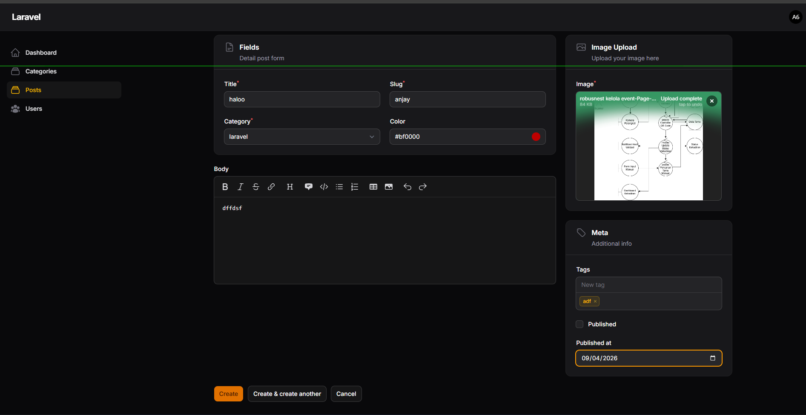

# Laporan Tugas Jobsheet 02 - Custom Layout Form Filament

**Identitas Mahasiswa**
Nama: Achmad Daud Roichan
NIM: 244107020005
Kelas: TI-2F
Semester: 2026/2027

**Fitur Aplikasi**
1. **Custom Form Layout pada Post Resource**
Halaman form Create dan Edit Post pada panel admin telah dikustomisasi secara komprehensif agar tampilannya lebih proporsional, rapi, dan profesional. Modifikasi ini mengubah tata letak form default yang membosankan (linier dari atas ke bawah) menjadi tata letak berbasis Grid dua kolom yang interaktif.
- **Route:** /admin/posts/create dan /admin/posts/{record}/edit
- **Resource:** App\Filament\Admin\Resources\PostResource
- **View/Schema:** App\Filament\Admin\Resources\Posts\Schemas\PostForm
- **Deskripsi Detail:** Form dibagi mengandalkan rasio kolom 2/3 dan 1/3. 
  - **Kolom Utama (Kiri):** Mengambil ruang lebih besar (column span 2). Berisi Section "Fields" yang mencakup komponen esensial seperti Title, Slug, Category, dan Color Picker. Di bawahnya terdapat Markdown Editor untuk isi konten (body) yang memakan lebar penuh (columnSpanFull()).
  - **Kolom Sidebar (Kanan):** Mengambil ruang lebih kecil (column span 1). Berisi Section "Image Upload" khusus untuk mengatur gambar unggulan, serta Section "Meta" untuk kelengkapan data seperti Tags (menggunakan TagsInput), status Publish (Checkbox), dan tanggal terbit (DatePicker). Penambahan deskripsi dan ikon pada masing-masing section membuat user interface semakin intuitif.

**Struktur Project**
`	ext
app/Filament/Admin/Resources/
├── PostResource.php           # Resource controller utama untuk model Post. Mengatur tabel dan pemanggilan form.
└── Posts/
    └── Schemas/
        └── PostForm.php       # Class representasi khusus untuk mendefinisikan layout dan skema Form secara terisolasi.
`

**Teknologi yang Digunakan**
- **Framework:** Laravel 11.x / 12.x
- **Admin Panel:** Filament PHP v3
- **Language:** PHP 8.x
- **Database:** SQLite / MySQL

**Screenshot Hasil**
1. **Halaman Create Post (Custom Layout)**

**Deskripsi Screenshot:** Tampilan komprehensif dari form "Create Post" yang telah memiliki Custom Layout. Terlihat jelas pembagian ruang layar menjadi sisi kiri yang lebar untuk entri data teks dan artikel, berdampingan dengan sisi kanan yang difokuskan untuk atribut media dan meta data. Masing-masing kotak (Section) dilengkapi dengan styling border, header, ikon, dan deskripsi singkat yang memandu administrator aplikasi.

**Jawaban Analisis & Diskusi**
1. **Mengapa layout form penting dalam aplikasi admin?**
   *Jawaban:* Layout form yang baik sangat krusial untuk meningkatkan pengalaman pengguna (UX) dan efisiensi *data entry*. Aplikasi admin umumnya menangani input data yang banyak dan kompleks. Layout yang tertata dan dikelompokkan secara logis akan mengurangi beban kognitif pengguna, mempercepat proses pengisian, serta meminimalisir *human error* karena alur pengisian (navigasinya) menjadi lebih jelas dan terarah.

2. **Apa perbedaan Section dan Group?**
   *Jawaban:* 
   - **Section** digunakan untuk pengelompokan visual. Komponen ini membungkus field yang saling berkaitan ke dalam sebuah "kartu" (card) yang memiliki batas (border), latar belakang, *heading* (judul), ikon, maupun deskripsi.
   - **Group** digunakan untuk pengelompokan struktural tanpa memberikan desain visual tambahan. Group secara harfiah membungkus beberapa komponen atau *Section* sekaligus agar dapat dikendalikan bersama-sama dalam sebuah grid (misalnya menentukan ->columnSpan() untuk satu kesatuan blok layar di kiri/kanan).

3. **Kapan kita menggunakan columnSpanFull()?**
   *Jawaban:* Metode columnSpanFull() digunakan ketika kita memiliki sebuah field atau komponen input yang membutuhkan ruang secara maksimal (membentang dari tepi kiri blok hingga ujung kanan ruangan terluarnya). Contoh penerapannya sangat umum pada *WYSIWYG Editor* atau *Markdown Editor* untuk isi panjang seperti artikel (ody), *Textarea*, tabel relasi data, atau file uploader berjumlah masif agar antar-muka tidak sumpek jika dihimpit pada kolom kecil.

4. **Apa keuntungan sistem grid 12 kolom?**
   *Jawaban:* Sistem grid 12 kolom adalah standar industri tata letak pada web modern dengan keuntungan utama pada tingkat **fleksibilitas**. Angka 12 merupakan bilangan yang punya banyak faktor pembagi bulat (1, 2, 3, 4, 6, 12). Hal ini memberikan kebebasan mutlak perancangan untuk membagi layar dengan proporsi kaya desain, seperti membagi dua rata (6/6), sepertiga (4/4/4), atau proporsi asimetris yang kita buat berupa rasio sepertiga dan dua-pertiga sisanya (span 4 berdampingan span 8). Kemudahan ini juga mengakomodasi desain responsif lintas ukuran monitor maupun layar HP.
