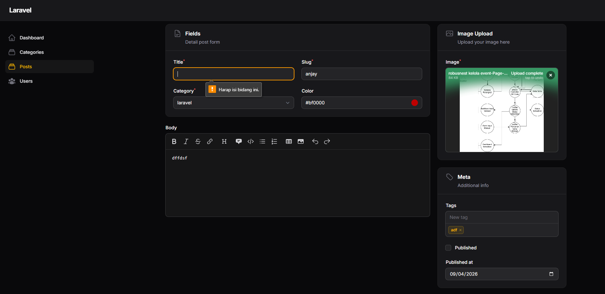

# Laporan Tugas Jobsheet 03 - Implementasi Form Validation Filament

**Identitas Mahasiswa**
Nama: Achmad Daud Roichan
NIM: 244107020005
Kelas: TI-2F
Semester: 2026/2027

**Fitur Aplikasi**
1. **Form Validation Post Resource**
Sistem form Post telah diperkuat dengan implementasi validasi data di sisi *backend* maupun *frontend* (Livewire). Fitur ini bertindak sebagai penjaga gerbang yang memastikan seluruh input pengelola (admin) sesuai dengan format dan aturan (*business rules*) sebelum diizinkan masuk bersarang ke pangkalan data (database).
- **Route:** /admin/posts/create dan /admin/posts/{record}/edit
- **Resource:** App\Filament\Admin\Resources\PostResource
- **View/Schema:** App\Filament\Admin\Resources\Posts\Schemas\PostForm
- **Deskripsi Detail:** Terdapat beberapa lapis aturan validasi yang dicangkokkan ke form post lewat metode perangkaian (*method chaining*) khas Filament:
  - Eksekusi ->required() diimplementasikan pada entri data kolom tak boleh kosong (seperti *title*, *slug*, foreign key relasi kategori, dan file unggahan *image*).
  - Eksekusi limitasi teks diterapkan melalui ->rules('min:3|max:100') pada kolom *title* supaya kelak terhindar dari spam tulisan pendek atau meledaknya limit *varchar* database.
  - Eksekusi otentifikasi redudansi diterapkan pada atribut *slug* melalui fungsi ->unique(ignoreRecord: true) yang tak lupa ditransformasikan peringatannya menggunakan ->validationMessages(['unique' => 'Slug harus unik.']) demi panduan antarmuka ramah pelokalan.

**Struktur Project**
`	ext
app/Filament/Admin/Resources/
├── PostResource.php           # Entry-point resource untuk memfasilitasi form validation bekerja secara sistemik bersama Create/Edit pages.
└── Posts/
    └── Schemas/
        └── PostForm.php       # Skema yang memuat metode validasi pada field UI (dimana aturan didefinisikan satu-per-satu per input).
`

**Teknologi yang Digunakan**
- **Framework:** Laravel 11.x / 12.x
- **Admin Panel:** Filament PHP v3 (didukung infrastruktur Livewire)
- **Language:** PHP 8.x
- **Database:** SQLite / MySQL

**Screenshot Hasil**
1. **Halaman Create Post (Error Validation Triggered)**

**Deskripsi Screenshot:** Tangkapan antarmuka menunjukkan momen ketika form berusaha disubmit menekan tombol "Create" dengan sengaja dibiarkan berstatus kosong atau tak mencapai batas minimum huruf yang ditentukan. Muncul pop-up alert (*notification warning*) merah di atas kanan serta peringatan langsung di bawah garis batas kotak form (*inline validation error*). Tampak pesan "Slug harus unik." jika sistem menemukan bentrok pemakaian data slug. Validasi memblokir jalan ke tahap simpan database dengan mulus tanpa putus (AJAX-based).

**Jawaban Analisis & Diskusi**
1. **Mengapa validasi penting pada admin panel?**
   *Jawaban:* Validasi amat fundamental dalam aplikasi *admin panel* untuk menjamin **integritas data**. Meski panel admin tidak terpapar publik (hanya diakses pelayan konten), satu kekeliruan isi form seperti string teks yang dimasukkan ke slot angka, atau kolom penting dikosongkan (nilai *null* yang tak diizinkan) dapat melahirkan *fatal error*, merusak format API, serta membuat *database* terisi 'sampah' yang lalu menjalar menumbangkan sistem penampil data pembaca *(FE display)*. Validasi bertindak layaknya benteng keamanan dan konsistensi operasional perusahaan.

2. **Apa perbedaan validasi client-side dan server-side?**
   *Jawaban:* 
   - **Client-side Validation:** Validasi yang dijalankan via browser di perangkat pengguna (menggunakan tag HTML5 
equired, pattern, maupun JavaScript eksternal). Fokus utilitasnya adalah mendongkrak pengalaman cepat membalik tanggapan (*User Experience*/UX) karena tidak mengirim *request* jauh-jauh ke server sebelum diverifikasi di tempat. Namun, ini tidak aman dari peretas modifikasi inspeksi browser (*Bypassing*).
   - **Server-side Validation:** Validasi absolut perisai terakhir yang bekerja di jantung layanan *backend* (menggunakan kelas bawaan PHP/Laravel Validator). Berfungsi murni demi keamanan sejati. Segala bentukan *request payload* akan dibedah ulang di tempat yang tak bisa dipalsukan peretas. Dalam ekosistem Filament, pengguna dihibur sensasi kilat *client-side* murni, sementara sesungguhnya mesin *server-side* Livewire secara instan menangani keamanannya dengan mutlak di belakang layar.

3. **Mengapa unique otomatis bekerja saat edit data?**
   *Jawaban:* Logika validasi data identik di-set untuk memproteksi database dari pencurian entitas satu sama lain. Pada saat melakukan "pembaruan edit", form harus menyelamatkan entitas targetnya sendiri. Di Filament, kita menggunakan parameter konfigurasi cerdas khusus: ->unique(ignoreRecord: true). Apabila perintah ini hidup, Filament segera menukar instruksi Validator pusat Laravel agar **mengecualikan (*ignore*) memvalidasi ID Primary Key Record yang kala itu sedang dibuka/di-edit**. Jadi, menekan save berulangkali pada artikel dengan slug yang *sama identik* tidak akan mencetuskan *error*, karena ID tersebut diundang masuk dalam "daftar putih / whitelist" pelacakan duplikat.

4. **Kapan kita perlu menggunakan rules array dibanding string?**
   *Jawaban:* Mendefinisikan regulasi menggunakan format **string** ("
equired|string|max:255") disarankan dipakai saat menghadapi aturan validasi sehari-hari dan gampang terbaca satu baris lurus pipanya (*pipe-delimited*). Format **array** diwajibkan bila kita menemui kondisi teknis seperti:
   - Menyisipkan Objek Instance Validasi Kustom Laravel (contoh: [new PasswordStrengthRule(), Rule::in(['A', 'B'])]).
   - Menyertakan validasi berjenis pola spesifik Regular Expression (*Regex*)—yang kebetulan *syntax*-nya punya pemisah pipa murni internal yang rentan menipu pisau pemotong (*delimiter*) validasi Laravel yang menggunakan logika explode('|').
   - Menggunakan bahasa pengkodan dinamis (mendapatkan rentang string melalui penugasan variable lain) yang terlalu membingungkan bila dirangkai satu persatu.
