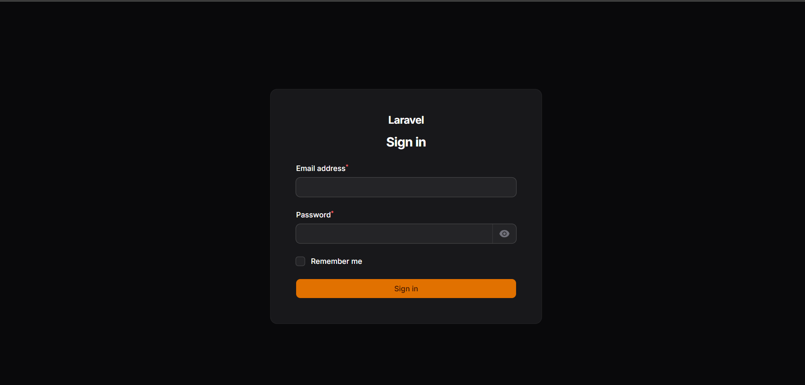
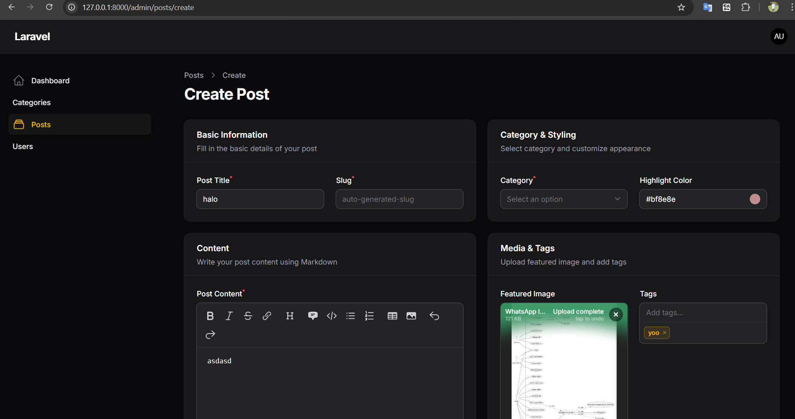

# LAPORAN PRAKTIKUM PEMROGRAMAN WEB LANJUT (PWL) - WEEK 6

**Nama:** Achmad Daud Roichan  
**NIM:** 244107020005  
**Kelas:** TI-2F  
**Semester:** 2026/2027

---

## Modul/Bab - Implementasi Form Elements & Resource Post di Filament

### 1. Generate Model, Migration & Akses Server

Pertama, kita membuat model `Post` beserta file migrasi untuk mengatur tabel di database:

```bash
php artisan make:model Post -m
```

Kita juga menyiapkan `up()` method di migrasi `*_create_posts_table.php` dengan kolom seperti title, slug, body, category_id, image, dll serta menjalankan migrasi awal. Selanjutnya, kita menyalakan server lokal Laravel:

```bash
php artisan serve
```

**Screenshot:**  


**Pengamatan:** File migrasi tereksekusi dengan sukses. Server server lokal dapat diakses dengan baik dan Filament dapat berjalan lancar.

---

### 2. Membuat Resource Filament (PostResource)

Perintah Artisan untuk generate resource secara modular di Filament versi terbaru:

```bash
php artisan make:filament-resource Post --panel=admin
```
Hal ini menghasilkan beberapa file sekaligus secara arsitektur terpisah:
- `PostResource.php` sebagai namespace root.
- `Schemas\PostForm.php` mengatur layout data input builder form.
- `Tables\PostsTable.php` untuk customisasi dashboard CRUD builder tabel.

**Screenshot:**
> *(Silakan tambahkan gambar tampilan resources di panel Filament: ``)*

**Pengamatan:** Pemisahan logic antara Table dan Schema memudahkan manajemen code CRUD yang di handle admin panel agar tidak bertumpuk di satu file raksasa `PostResource.php`.

---

### 3. Configurasi Form Input & Schema

Modifikasi form post yang kaya fitur form (rich-element) pada file `Posts\Schemas\PostForm.php`:

```php
Section::make('Basic Information')
    ->description('Fill in the basic details of your post')
    ->schema([
        TextInput::make('title')
            ->required()
            ->maxLength(255),
        TextInput::make('slug')
            ->required()
            ->unique(Post::class, 'slug', ignoreRecord: true),
    ])->columns(2),
```

Dibuatlah modifikasi menggunakan banyak element input: *MarkdownEditor*, *FileUpload*, *ColorPicker*, dan *TagsInput*. Serta modifikasi namespace karena versi baru menggunakan class Component struktural `Filament\Schemas\Components\Section` (bukan yang lama `Forms`).

**Screenshot:**
> *(Tampilan halaman Form Create Post)*  
> 

**Pengamatan:** Field input form berhasil di-render dalam layout bentuk multi section-kolom, contohnya editor teks berbasis markdown, input warna, unggahan gambar (FileUpload) berjalan mulus.

---

### 4. Konfigurasi Daftar Post di Admin Table Resource

Menyesuaikan struktur file `PostsTable.php` untuk menampilkan grid admin tabel yang relevan (Gambar Thumbnail, text Title, nama Relasi Kategori yang diambil, status Toggle Publikasi).

```php
TextColumn::make('title')
    ->searchable()
    ->sortable(),

ImageColumn::make('image')
    ->disk('public'),

BooleanColumn::make('published'),
```

**Screenshot:**
> *(Silakan tambahkan gambar tampilan web CRUD List Tables: ``)*

**Pengamatan:** Tabel admin list record resource sudah menggunakan fungsi filter (`TernaryFilter` & `SelectFilter`), table sorting, pencarian kolom text, serta relasional nama Kategori terload (`category.name`).

---

## Analisis & Diskusi (Pertanyaan Jobsheet)

**1. Analisis pemisahan arsitektur error `Filament\Forms\Components` dan `Filament\Schemas\Components` di versi terbaru**  
*Jawaban dan Analisis:*
Pada pembaruan arsitektur Filament versi termutakhir, letak kerangka block *layout/wrapper* (seperti `Section`, `Grid`, dll) dialihkan menjadi bagian namespace modul `Filament\Schemas`. Namun control murni input value data (seperti `TextInput`, `Select`, `ColorPicker`) posisinya tetap dipertahankan alias berasal dari base komponen `Filament\Forms\Components`. Solusi ini memberikan hirarki antarmuka builder GUI yang jauh lebih bersih namun sering mengagetkan developer lama karena timbulnya Type Error jika tidak diubah _import alias_ *use*-nya di code PHP, ini sudah diatasi dengan modifikasi class structure.

**2. Kenapa method `ignoreRecord: true` pada unique validation attribute di kolom input url `slug` sangat penting?**  
*Jawaban dan Analisis:*
Ketika admin situs melakukan pengubahan/edit terhadap data record *post* (`update`), sistem base Validation Laravel akan memeriksa atribut URL slug. Parameter tambahan `ignoreRecord: true` disematkan karena rule validator harus secara logis "mengabaikan" eksistensi nilai unik record ID post yang saat itu posisinya sama persis saat sedang disunting agar fatal error redudansi / duplikat `Unique Constraint Validation` tidak terjadi dan menganggap nilai lama *slug*-nya wajar jika tidak diubah oleh user.

**3. Penjelasan mekanisme simpanan Uploading Foto di `FileUpload::make('image')`**  
*Jawaban dan Analisis:*
Elemen trait ini berperan memproses file unggahan binary *img* yg dilakukan via POST request, lalu akan menyimpannya menggunakan file public system disk bawaan Framework Laravel (`public` dan di *directory "post"*). Konsekuensinya data record table MySQL tidak menyimpan blob gambarnya secara *raw*, hanya nama string path URL file statisnya di kolom tabel yang direturn. Cukup efisien untuk performa database server.

**4. Penggunaan field Component List dinamis lewat Relasi ORM model**  
*Jawaban dan Analisis:*  
Implementasi code `$query->Category::all()->pluck('name', 'id')` bertindak mengatur menu selection opsi Input data kategori ke form, menggunakan array mapping nama kolom `id` kedalam value asli record dan me-return output UI list String `name` kategori. Hal ini merupakan jembatan implementasi integrasi ID kunci tamu (Foreign ID) secara *fluent* / mulus menggunakan relasi ORM model dan *Collection* langsung ke antarmuka aplikasi.
