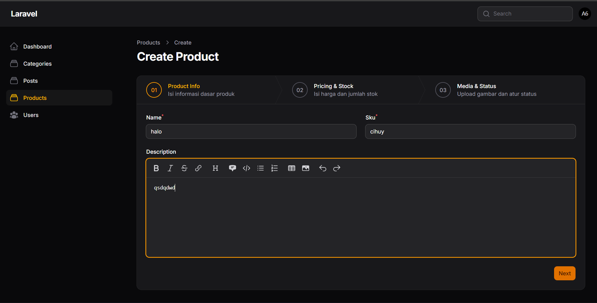
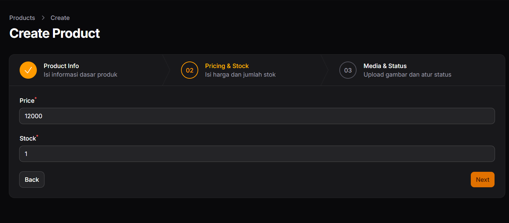

# Laporan Praktikum - Jobsheet 1

## Identitas Mahasiswa
**Nama:** Achmad Daud Roichan  
**NIM:** 244107020005  
**Kelas:** TI-2F  
**Semester:** 2026/2027  

---

**Mata Kuliah:** Pemrograman Web Lanjut  
**Pertemuan:** 7 – Implementasi Wizard Form (Multi Step Form) di Filament

## Deskripsi Singkat
Pada praktikum kali ini, saya telah mengimplementasikan komponen **Wizard Form** pada form pembuatan produk di Filament. Penggunaan format Wizard ini membagi form input yang panjang menjadi beberapa langkah yang lebih terstruktur.

Langkah-langkah dipecah menjadi 3 (tiga) step utama:
1. **Product Info:** Mengisi nama, SKU, dan deskripsi produk.
2. **Pricing & Stock:** Mengisi detail harga dan jumlah persediaan/stok produk.
3. **Media & Status:** Mengupload gambar produk dan mengatur status (active/featured).

Aksi formulir (submit action) juga telah diperbarui untuk mengarahkan pengguna secara otomatis ke halaman (View) setelah data berhasil disimpan.

## Hasil Tampilan (Screenshots)

### 1. Step 1: Product Info
Pada tahap ini, pengguna memasukkan informasi dasar produk.

### 2. Step 2: Pricing & Stock
Tahap selanjutnya menampilkan kolom input untuk harga (Price) dan Stok.

### 3. Step 3: Media & Status
Langkah terakhir digunakan untuk proses unggah media (gambar) dan penentuan status (Aktif dan Featured).

---

## Analisis & Diskusi (Jobsheet 1)

1. **Mengapa Wizard Form lebih baik untuk form panjang?**  
   Wizard form memecah langkah-langkah yang panjang menjadi bagian-bagian kecil *(chunking)*. Hal ini dapat mengurangi "beban kognitif" *(cognitive load)* pengguna, menavigasi form panjang menjadi lebih rapi, dan meminimalisasi kesalahan (karena validasi terjadi pada masing-masing step).

2. **Kapan kita menggunakan `skippable()`?**  
   Tribut `skippable()` pada step wizard digunakan ketika urutan step tertentu tidak diwajibkan untuk diisi informasinya (opsional). Ini berguna saat data di step tesebut tidak diperlukan sebagai landasan informasi untuk melangkah pada input yang menyertainya di step berikutnya.

3. **Apa kelebihan multi step dibanding single form panjang?**  
   - Lebih *user-friendly* karena field isian tidak menakut-nakuti/terlihat mengerikan pada pandangan awal.  
   - User dapat lebih mudah memeriksa kesalahan (karena form divalidasi per-step).  
   - Menampilkan *progress bar* *(step navigation)*, sehingga pengguna tahu ke arah tahapan mana mereka mengisi dan berapa sisanya.

4. **Apakah wizard cocok untuk semua jenis form?**  
   Tidak. Wizard hanya direkomendasikan untung form yang kompleks dan panjang. Untuk input yang pendek (seperti Form Login, Ubah Password, dll) penggunaan wizard justru memperlama interaksi.

## Kesimpulan
Penggunaan Wizard Component memudahkan pengguna (admin) dalam mengentri data yang kompleks, meminimalisir kesalahan, dan membuat *User Experience (UX)* backend menjadi lebih interaktif.