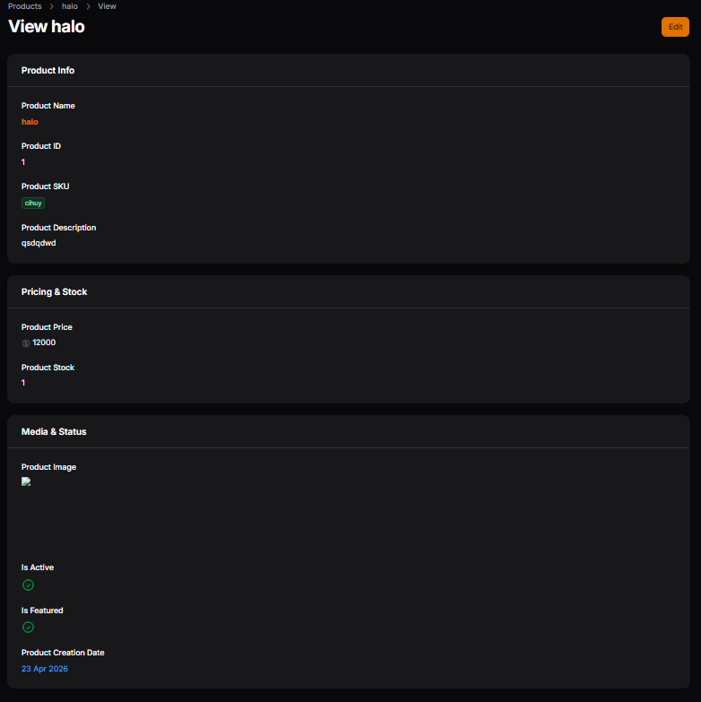

# Laporan Praktikum - Jobsheet 2

## Identitas Mahasiswa
**Nama:** Achmad Daud Roichan  
**NIM:** 244107020005  
**Kelas:** TI-2F  
**Semester:** 2026/2027  

---

**Mata Kuliah:** Pemrograman Web Lanjut  
**Pertemuan:** 8 – Implementasi Info List (View Page) di Filament

## Deskripsi Singkat
Praktikum ini membahas mengenai cara mengubah tampilan detail record (View Page) pada Filament agar tidak lagi berbentuk form input, melainkan menjadi bentuk **Info List** yang merupakan mode *read-only display*.

## Implementasi & Komponen yang Digunakan
Beberapa komponen yang telah digunakan dalam membangun halaman view (Info List) ini antara lain:
- **TextEntry:** Menampilkan teks seperti Nama, ID, Deskripsi, dan Harga. Teks juga disesuaikan *(formatting)* menggunakan properties seperti `weight('bold')` dan `color()`.
- **ImageEntry:** Digunakan untuk merender gambar yang sebelumnya telah diunggah melalui formulir.
- **IconEntry:** Berfungsi menampilkan format visual (checkmark atau tanda silang silang) terhadap data tipe boolean (seperti atribut `is_active` dan `is_featured`).

Selain itu, data-data tersebut dikelompokkan menjadi beberapa bagian menggunakan fungsi `Section::make()`. Data terkait seperti SKU diberikan badge agar terlihat lebih menonjol, dan harga dipasangkan dengan icon dolar.

## Hasil Tampilan
Berikut adalah tangkapan layar untuk *View Page* data produk yang telah mengimplementasikan Info List Section:

---

## Analisis & Diskusi (Jobsheet 2)

1. **Mengapa View Page tidak cocok menggunakan form input?**  
   View Page seharusnya digunakan untuk menampilkan detail informasi bagi pengguna secara *read-only*. Form Input justru terkesan mengundang dan bisa menyebabkan pengguna secara tidak sengaja melakukan perubahan *editable field* saat mereka hanya ingin melakukan ulasan (cek) ulang data.

2. **Apa perbedaan `TextColumn` dan `TextEntry`?**  
   - `TextColumn` digunakan di dalam lingkungan **Tabel** pada Filament, yang mengonfigurasi daftar kolom (grid berbaris-baris record).  
   - `TextEntry` digunakan di dalam **Infolist**, yang bertugas mengatur komponen *(display field)* yang tampil untuk menjelaskan data hanya tentang **1 (*satu*) record spesifik**.

3. **Kapan kita menggunakan badge?**  
   `badge()` digunakan jika kita ingin teks informasi terlihat lebih menonjol dibandingkan teks regulernya. Umum digunakan untuk menandakan "status" seperti Active/Inactive, warna Label Penanda khusus, maupun SKU.

4. **Apa keuntungan menggunakan `IconEntry` untuk boolean?**  
   Lebih intuitif secara visual. Mata manusia jauh lebih cepat membedakan arti visual dari ikon "centang" *(check)* untuk true/aktif maupun ikon "silang" *(x)* ketimbang harus membaca teks boolean seperti `1/0` atau `Kering/Non-Kering`.

   ## Kesimpulan
Perubahan dari representasi berupa Input Form menuju representasi *Read-Only* sangat penting untuk bagian "View" guna menghindari pengguna tanpa sengaja mengubah data sekaligus menampilkan data dengan tampilan yang jauh lebih bersih dan profesional.