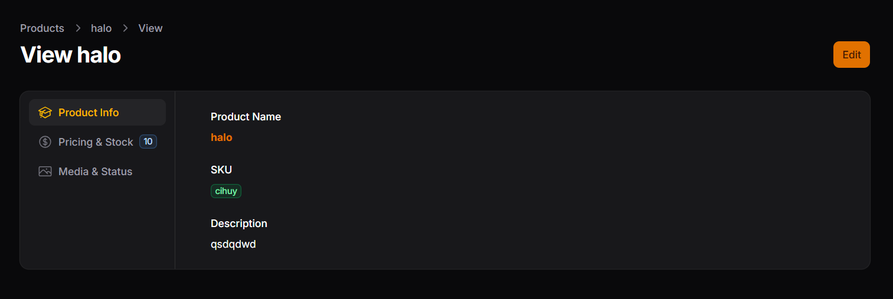

# Laporan Praktikum - Jobsheet 3

## Identitas Mahasiswa
**Nama:** Achmad Daud Roichan  
**NIM:** 244107020005  
**Kelas:** TI-2F  
**Semester:** 2026/2027  

---

**Mata Kuliah:** Pemrograman Web Lanjut  
**Pertemuan:** 9 – Implementasi Tabs pada Info List di Filament

## Deskripsi Singkat
Praktikum ini merupakan perbaikan lebih lanjut dari antarmuka *View Page* *(Info List)* pada Filament. Mengingat tampilan menggunakan Section tunggal dapat membuat halaman memanjang *(scrolling issue)* bila isi detail sangat banyak, pada pertemuan ini kita menggunakan fitur **Tabs**.

## Implementasi
Layout *View Page* produk yang awalnya diatur menurun diganti memanggil fungsi `Tabs::make(...)`. 
- Setiap bagian dibagi menjadi `Tabs\Tab::make(...)` yang sesuai dengan pembagian dari Wizard, yakni: **Product Info**, **Pricing & Stock**, dan **Media & Status**.
- Masing-masing tab ditambahkan dekorasi agar terlihat lebih menarik menggunakan metode `icon()`, `badge()`, serta `badgeColor()`.
- Navigasi tab kemudian diset menjadi orientasi list menyamping menggunakan method `->vertical()`.

## Hasil Tampilan
Berikut ini adalah hasil akhir di mana daftar info dibagi dalam beberapa _tabs vertical_ yang dinavigasikan oleh tombol di sebelah kiri panel:

---

## Analisis & Diskusi (Jobsheet 3)

1. **Kapan kita menggunakan Tabs dibanding Section?**  
   Penggunaan Tabs diprioritaskan ketika detail/komponen view *(`Infolist`)* yang kita buat memuat informasi yang panjang secara *layout* atau dibagi menjadi terlalu banyak blok, hal tersebut berupaya demi menghindari pengguna meng-*scroll* (gulir) *(down scrolling)* yang panjang. Jika sebaliknya *(ringkas)*, *Section* jauh lebih optimal.

2. **Apa kelebihan Tabs untuk data panjang?**  
   Tabs sangat mempermudah pemilahan antarmuka (interface) data menjadi kategori-kategori ringkas yang sesuai konteks *(terfokus)*, sangat bersih, serta mempercepat akses bagi pemakai *(end-users)* yang hanya ingin menemukan bagian/sub-detail komponen data terspesifik dalam pandangan satu tab *(contoh: mencari langsung tab image/media)*.

3. **Apakah Tabs bisa digunakan pada Form juga?**  
   Iya, Filament sangat flexsibel menangani peruntukkan **Tabs** dengan baik pada pembuatan form *(Input Views via `Schema::components([ Tabs::make() ])`)* sebagai perbaikan layout dan mengurangi scroll horizontal/vertikal juga pada form editing *(layouting forms)*.

4. **Bagaimana jika tab terlalu banyak?**  
   Maka sistem menu di tab yang terlalu beragam atau memanjang akan memakan area navigasi/menu bar (bila horizontal) dengan padat (cluttered), hal ini justru tidak kondusif bagi UI. Jika Tabs dirasa harus bertambah, maka solusi terbarunya yaitu memprioritaskan konfigurasi `->vertical()` sehingga label *tab actions* terlihat mirip dengan *menu sidebar UI* yang cukup panjang secara vertikal layaknya sistem yang dicontohkan di atas.

   ## Kesimpulan
Penggunaan Tabs (terlebih Tabs Vertical) ini membantu *User Experience* administrasi dengan membuat ringkasan yang lebih kompak dan mengurangi *scroll* berkepanjangan pada bagian konten detail.
