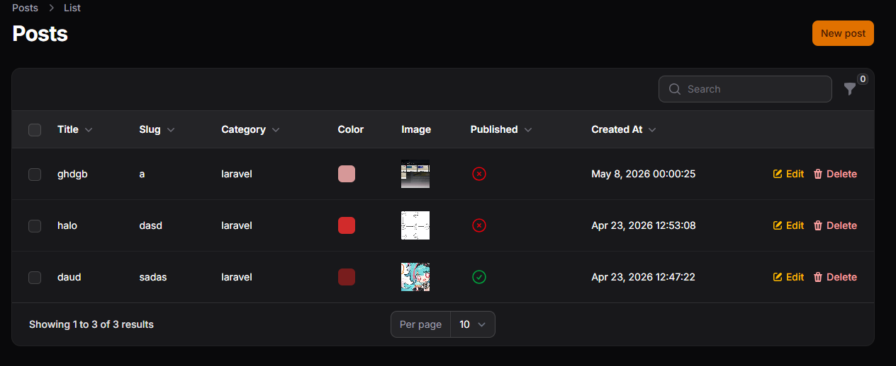

# Laporan Praktikum - Jobsheet

## Identitas Mahasiswa
**Nama:** Achmad Daud Roichan  
**NIM:** 244107020005  
**Kelas:** TI-2F  
**Semester:** 2026/2027  

---

**Mata Kuliah:** Pemrograman Web Lanjut  
**Pertemuan:** 10 – Implementasi Sorting (Ascending & Descending) pada Table Filament

## Deskripsi Singkat
Pada praktikum pertemuan 10 ini, saya telah mengimplementasikan fitur sorting (urutan) di dalam Admin Panel Filament. Dengan menambahkan *chaining method* sederhana pada pengaturan kolom tabel, kita dapat mempermudah proses manipulasi tampilan data pada *List Records*.

Implementasi yang dilakukan pada module **Posts** mencakup:
1. Mengaktifkan fitur klik tabel header untuk proses penyortiran `Ascending`/`Descending` pada kolom Title dan Slug menggunakan method `->sortable()`.
2. Melakukan implementasi `sortable()` untuk atribut relasi yaitu `Category`.
3. Mengaktifkan *sortable* pada format kolom waktu `Created At`.
4. Menerapkan konfiugrasi tabel untuk me-*render* data secara bawaan dengan urutan terbaru (`->defaultSort('created_at', 'desc')`).

## Hasil Tampilan (Screenshots)

Berikut ini adalah hasil halaman tabel Posts yang secara bawaan (*default*) sudah berada pada status Sorting *Descending* yang dihitung dari kolom *Created At*.

---

## Analisis & Diskusi

1. **Mengapa sorting penting pada admin panel?**  
   Fitur sorting menjadikan antarmuka admin jauh lebih mudah dikelola (terutama saat berhadapan dengan basis data masif). Dengan *sorting*, seorang admin dapat merekapitulasi data dari abjad *(title)* atau mengambil tanggal terbaru tanpa harus menelusuri halaman [*pagination*] satu per satu dari awal sampai akhir.

2. **Apa perbedaan sortable biasa dengan defaultSort()?**  
   - `sortable()`: Memunculkan indikator/ikon klik di sisi atas tabel (*header* kolom), dan datanya baru diututkan secara interaktif hanya saat *user* mengeklik *header* terkait secara manual.
   - `defaultSort()`: Ini merupakan inisialisasi query awal. Konfigurasi ini menjadikan halaman langsung mengurutkan tabel sejak detik pertama dirender secara bawaan (bahkan tanpa perlu interaksi pengguna pada klik dari kolom manapun).

3. **Mengapa relasi tetap bisa di-sort?**  
   Filament berjalan di atas Eloquent ORM Laravel. Ketika kita mendefinisikan *sortable()* pada kolom relasi (seperti `category.name`), Filament sangat cerdas untuk merajut query MySQL dengan proses *JOIN* relasi model tersebut di latar belakang. Sehingga, perlakuan kondisional *ORDER BY* dapat tereksekusi mulus meski bukan dari tabel utama.

4. **Kapan kita menggunakan `desc` sebagai default?**  
   Penggunaan *Descending* secara struktur umum/ideal digunakan pada baris data yang bergantung pada waktu kronologis seperti kolom waktu modifikasi, transaksi, logs file, atau `created_at` pada postingan blog. Tujuannya adalah memastikan bahwa aktivitas modifikasi terbaru selalu diusahakan menjadi hal pertama yang diperlihatkan di pojok paling atas layar admin.