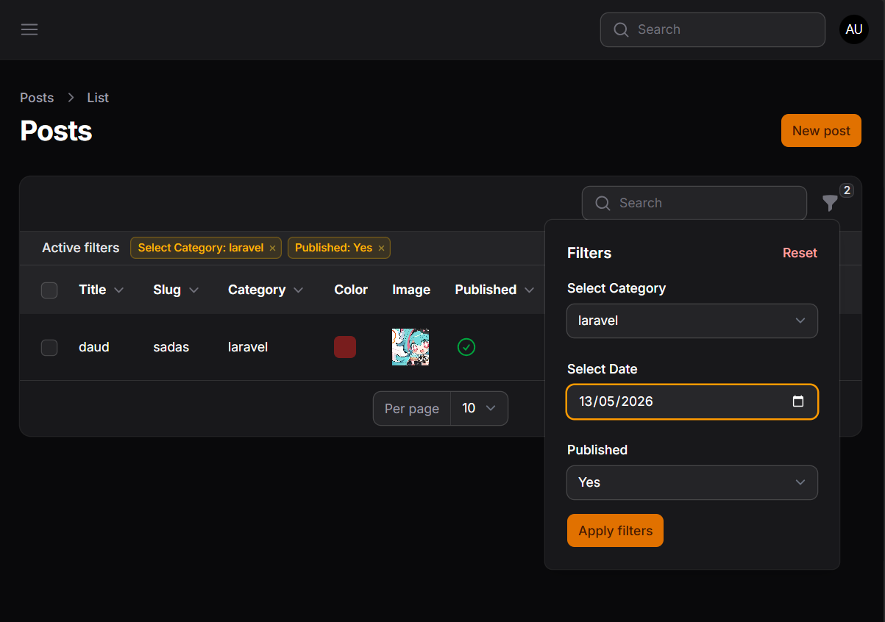

# Laporan Praktikum - Jobsheet

## Identitas Mahasiswa
**Nama:** Achmad Daud Roichan  
**NIM:** 244107020005  
**Kelas:** TI-2F  
**Semester:** 2026/2027  

---

**Mata Kuliah:** Pemrograman Web Lanjut  
**Pertemuan:** 11 – Implementasi Filter dan Search pada Table Filament

## Deskripsi Singkat
Pada praktikum pertemuan 11 ini, saya telah mengimplementasikan fitur filter dan search di dalam Admin Panel Filament. Dengan menggunakan berbagai tipe filter dan search functionality, kita dapat mempermudah proses pencarian serta penyaringan data pada *List Records*.

Implementasi yang dilakukan mencakup:
1. Menggunakan `SearchFilter` untuk mencari data berdasarkan teks (*text-based search*) pada kolom tertentu.
2. Mengimplementasikan `SelectFilter` dengan `relationship()` untuk memfilter data berdasarkan relasi model (category, author, dll).
3. Menerapkan `DateFilter` dengan `whereDate()` untuk memfilter data berdasarkan tanggal spesifik.
4. Membedakan antara fitur `searchable()` yang bersifat real-time global search dan `filters()` yang merupakan filter spesifik dengan UI dedicated.
5. Mengintegrasikan berbagai jenis filter ke dalam tabel untuk pengalaman filtering yang komprehensif.

## Hasil Tampilan (Screenshots)

Berikut ini adalah hasil halaman tabel dengan implementasi berbagai jenis filter dan search functionality pada Admin Panel Filament.



---

## Analisis & Diskusi

### 1. Mengapa search tidak cocok untuk filter tanggal?

Search functionality (pencarian berbasis teks) tidak cocok untuk filter tanggal karena beberapa alasan teknis:

- **Format Data Tanggal**: Tanggal dalam database biasanya disimpan dalam format `YYYY-MM-DD` atau `YYYY-MM-DD HH:MM:SS`. Seorang user tidak akan menginput tanggal secara eksak dengan format tersebut melalui search box biasa—mereka hanya akan mengetik "Mei 2026" atau "11-05" tanpa format lengkap.

- **Search menggunakan LIKE query**: Method `search()` pada Filament menggunakan SQL `LIKE` operator yang bersifat *string pattern matching*. Ini tidak optimal untuk data tanggal karena perbandingan teks pada tanggal tidak memberikan hasil logis (misalnya, mencari "05" akan cocok di teks apapun, bukan hanya tanggal 5 Mei).

- **Kebutuhan Date Range**: Filtering tanggal umumnya memerlukan rentang (range) seperti "dari tanggal X hingga tanggal Y", bukan pencarian individual. Search box tidak dirancang untuk input range.

- **User Experience**: User lebih nyaman memilih tanggal melalui date picker UI daripada mengetik format tanggal yang kompleks. Oleh karena itu, menggunakan `DateFilter` dengan UI calendar picker jauh lebih user-friendly.

**Solusi**: Gunakan `DateFilter` atau `TernaryFilter` untuk filtering tanggal, bukan `SearchFilter`.

---

### 2. Apa fungsi relationship() pada SelectFilter?

Method `relationship()` pada `SelectFilter` memiliki fungsi kritis untuk merelasikan filter dengan data dari tabel relasi (foreign key relationship).

**Fungsi utama:**

- **Memetakan Foreign Key**: `relationship()` memberitahu Filament bahwa filter ini harus menggunakan kolom relasi (misalnya `category_id`), dan data pilihan harus diambil dari tabel relasi `categories`.

- **Menampilkan Label Relasi**: Alih-alih menampilkan ID (`1`, `2`, `3`), Filament akan menampilkan nilai deskriptif dari tabel relasi seperti `category.name` (misal: "Teknologi", "Olahraga", "Bisnis").

- **Membangun Query JOIN**: Di latar belakang, Filament menggunakan Eloquent relationship untuk membangun query SQL dengan `JOIN` otomatis. Sehingga filtering relasi berjalan efisien tanpa perlu menulis query manual.

**Contoh penggunaan:**
```php
SelectFilter::make('category')
    ->relationship('category', 'name')  // Relasi 'category', tampilkan 'name'
```

Ini akan menampilkan daftar kategori dari tabel `categories` dan memfilter `posts` berdasarkan `category_id` yang dipilih.

---

### 3. Mengapa kita perlu whereDate() pada query filter?

Method `whereDate()` diperlukan pada query filter untuk alasan teknis SQL dan performa:

- **Mengabaikan Waktu**: Database menyimpan timestamp lengkap termasuk jam, menit, detik (misal: `2026-05-11 14:35:22`). Jika user memilih tanggal "11 Mei 2026" via date picker, mereka ingin mencari **seluruh hari** tersebut, bukan hanya detik spesifik. Method `whereDate()` mengekstrak hanya bagian *date* (tahun-bulan-hari) dari timestamp.

- **Presisi Query**: Menggunakan `where('created_at', '=', '2026-05-11')` pada tipe `datetime` akan gagal karena format tidak cocok. Sedangkan `whereDate('created_at', '2026-05-11')` akan bekerja sempurna dengan mengkonversi keduanya ke format date saja.

- **Performance**: `whereDate()` menghasilkan query SQL yang lebih efisien untuk perbandingan tanggal tunggal.

**Contoh:**
```php
// Tanpa whereDate() - TIDAK COCOK
$posts->where('created_at', '2026-05-11');  // Akan tidak match karena ada waktu

// Dengan whereDate() - BENAR
$posts->whereDate('created_at', '2026-05-11');  // Match seluruh hari 11 Mei 2026
```

---

### 4. Apa perbedaan searchable() dan filters()?

`searchable()` dan `filters()` adalah dua mekanisme pencarian/penyaringan yang berbeda dalam Filament:

| Aspek | `searchable()` | `filters()` |
|-------|----------------|-----------|
| **Tipe Pencarian** | Global, real-time text search | Filtering spesifik dengan UI dedicated |
| **UI** | Single search box (global top) | Multiple filter buttons/dropdowns |
| **Trigger** | User mengetik di search box | User klik filter dan pilih kriteria |
| **Scope** | Mencari di seluruh kolom yang ditandai `searchable()` | Hanya pada kolom/field yang ada filter |
| **Use Case** | Pencarian cepat nama, judul, email | Filtering berdasarkan kategori, status, tanggal |
| **SQL Operator** | `LIKE` (pattern matching) | `WHERE`, `=`, `>`, `<`, `DATE`, dll |
| **User Experience** | Cepat, tidak perlu banyak klik | Lebih terstruktur dan presisi |

**Analogi:**
- `searchable()` seperti **Google search bar** — Anda mengetik apapun dan sistem mencari kecocokan
- `filters()` seperti **Filter advanced di e-commerce** — Anda memilih kategori spesifik, harga range, rating, dll

**Contoh Implementasi:**
```php
// searchable() - di dalam Column atau relation
Table\Columns\TextColumn::make('title')
    ->searchable(),  // User bisa search dengan mengetik

// filters() - di bagian filter()
->filters([
    SelectFilter::make('category')
        ->relationship('category', 'name'),  // Pilih kategori dari dropdown
    DateFilter::make('created_at'),  // Pilih tanggal dari date picker
])
```

**Kesimpulan**: Gunakan `searchable()` untuk pencarian fleksibel dan `filters()` untuk penyaringan terstruktur. Keduanya dapat digunakan bersamaan untuk UX yang optimal.

---

## Kesimpulan
Implementasi filter dan search yang tepat pada admin panel sangat meningkatkan usability. Dengan memahami perbedaan antar tipe filter dan search, kita dapat memilih tool yang paling sesuai untuk setiap kebutuhan filtering data pada aplikasi.

