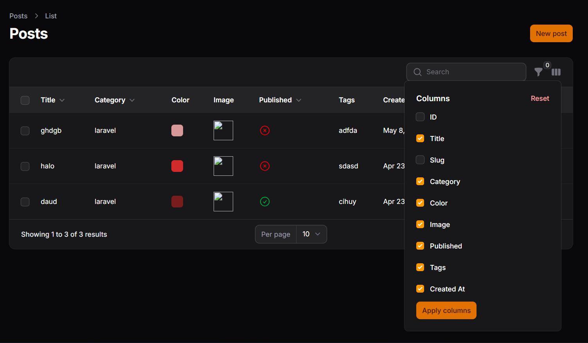

# JOBSHEET PRAKTIKUM - PERTEMUAN 12
## Implementasi Toggle Column pada Table Filament

## Identitas Mahasiswa
**Nama:** Achmad Daud Roichan  
**NIM:** 244107020005  
**Kelas:** TI-2F  
**Semester:** 2026/2027  

---

## Capaian Pembelajaran ✅

Setelah mengikuti praktikum ini, mahasiswa mampu:
- ✅ Menambahkan kolom baru pada tabel Filament
- ✅ Menggunakan IconColumn untuk boolean
- ✅ Mengaktifkan fitur toggleable() pada kolom
- ✅ Mengatur kolom agar tersembunyi secara default
- ✅ Memahami cara kerja penyimpanan preferensi kolom (session)

---

## Hasil Tampilan (Screenshot)

**Implementasi Toggle Column pada Table Post:**


```
⚙️ Icon Settings muncul di kanan atas tabel
Menampilkan menu toggle kolom dengan checkbox untuk setiap kolom
Kolom dapat disembunyikan/ditampilkan sesuai preferensi user
Preferensi otomatis tersimpan dalam session
```

---

## A. Latar Belakang

Pada tabel Post, kami memiliki banyak kolom yang dapat membuat tampilan tabel menjadi penuh dan kurang rapi. Solusi yang diterapkan adalah menggunakan fitur **Toggle Column**, sehingga:

- ✅ Kolom bisa disembunyikan sementara
- ✅ User dapat memilih kolom mana yang ingin ditampilkan
- ✅ Preferensi tersimpan otomatis dalam session

---

## B. Langkah-Langkah Implementasi

### File yang Diubah
**File:** `app/Filament/Admin/Resources/Posts/Tables/PostsTable.php`

### 1. Menambahkan Import IconColumn
```php
use Filament\Tables\Columns\IconColumn;
```

### 2. Menambahkan Kolom ID
**Kode:**
```php
TextColumn::make('id')
    ->label('ID')
    ->sortable()
    ->toggleable(isToggledHiddenByDefault: true),
```

**Penjelasan:**
- Menampilkan ID Post
- Disembunyikan secara default untuk menghemat ruang tampilan
- User dapat mengaktifkannya melalui menu toggle

### 3. Menambahkan Kolom Tags
**Kode:**
```php
TextColumn::make('tags')
    ->label('Tags')
    ->limit(50)
    ->toggleable(isToggledHiddenByDefault: true),
```

**Penjelasan:**
- Menampilkan tags dari post
- Disembunyikan secara default
- Maksimal 50 karakter dengan ellipsis

### 4. Mengubah Kolom Published menjadi IconColumn
**Kode Sebelumnya:**
```php
BooleanColumn::make('published')
    ->label('Published')
    ->sortable(),
```

**Kode Sesudah:**
```php
IconColumn::make('published')
    ->boolean()
    ->label('Published')
    ->sortable()
    ->toggleable(),
```

**Perubahan:**
- Dari `BooleanColumn` menjadi `IconColumn` untuk tampilan visual yang lebih baik
- Menambahkan `->boolean()` untuk menampilkan icon checkmark/close
- Menambahkan `->toggleable()` agar bisa disembunyikan

### 5. Mengaktifkan Toggleable pada Semua Kolom

| No | Kolom | Toggleable | Hidden Default | Keterangan |
|----|-------|-----------|-----------------|-----------|
| 1 | ID | ✅ | ✅ Ya | Disembunyikan default |
| 2 | Title | ✅ | ❌ Tidak | Ditampilkan default |
| 3 | Slug | ✅ | ✅ Ya | Disembunyikan default |
| 4 | Category | ✅ | ❌ Tidak | Ditampilkan default |
| 5 | Color | ✅ | ❌ Tidak | Ditampilkan default |
| 6 | Image | ✅ | ❌ Tidak | Ditampilkan default |
| 7 | Published | ✅ | ❌ Tidak | Ditampilkan default (IconColumn) |
| 8 | Tags | ✅ | ✅ Ya | Disembunyikan default |
| 9 | Created At | ✅ | ❌ Tidak | Ditampilkan default |

---

## C. Fitur Toggle Column Hasil Implementasi

### Yang Berhasil Diimplementasikan:

1. **Icon Settings Kolom** 
   - Muncul di kanan atas tabel
   - User dapat klik untuk membuka menu toggle

2. **Menu Toggle Kolom**
   - Menampilkan daftar semua kolom
   - Checkbox untuk setiap kolom
   - Tombol "Apply" untuk menerapkan perubahan

3. **Penyimpanan Otomatis**
   - Preferensi disimpan dalam session
   - Konfigurasi tetap tersimpan saat pindah halaman
   - Reset otomatis saat browser di-refresh atau logout

4. **Kolom Tersembunyi Default**
   - ID (disembunyikan)
   - Slug (disembunyikan)
   - Tags (disembunyikan)

---

## D. Penjelasan Kode & Konsep

### Toggleable() Tanpa Parameter
```php
->toggleable()
```
- Kolom ditampilkan secara default
- User dapat menyembunyikannya

### Toggleable dengan isToggledHiddenByDefault
```php
->toggleable(isToggledHiddenByDefault: true)
```
- Kolom tersembunyi secara default
- User dapat mengaktifkannya

### IconColumn untuk Boolean
```php
IconColumn::make('published')
    ->boolean()
```
- Menampilkan checkmark (✓) jika true
- Menampilkan close (✗) jika false
- Lebih visual dibanding true/false text

### Penyimpanan Preferensi
Filament **otomatis** menyimpan:
- Kolom yang diaktifkan
- Kolom yang disembunyikan
- Dalam storage: `session` atau `cookies` (default)

---

## E. Hasil Implementasi

### Sebelum Toggle Column
```
┌─────────────────────────────────────────────────────┐
│ Title | Slug | Category | Color | Image | Published │
├─────────────────────────────────────────────────────┤
│ ...                                                 │
└─────────────────────────────────────────────────────┘
```
- Semua kolom tampil
- Tampilan penuh
- Tidak fleksibel

### Sesudah Toggle Column
```
┌──────────────────────────────┐        ⚙️ Settings
│ Title | Category | Published │  ┌─────────────────┐
├──────────────────────────────┤  │ ☐ ID            │
│ ...                          │  │ ☑ Title         │
└──────────────────────────────┘  │ ☐ Slug          │
                                  │ ☑ Category      │
                                  │ ☑ Color         │
                                  │ ☑ Image         │
                                  │ ☑ Published     │
                                  │ ☐ Tags          │
                                  │ ☑ Created At    │
                                  │                 │
                                  │  [Apply]        │
                                  └─────────────────┘
```
- Bisa pilih kolom yang ingin ditampilkan
- Lebih fleksibel & rapi
- User dapat mengatur sendiri

---

## F. Analisis & Diskusi

### 1. Mengapa Toggle Column Penting pada Admin Panel?
**Jawab:**
- **Fleksibilitas:** Admin dapat memilih kolom yang relevan dengan kebutuhan mereka
- **Performa:** Menampilkan lebih sedikit kolom dapat meningkatkan performa rendering
- **User Experience:** Tampilan yang lebih rapi dan tidak overwhelming
- **Efisiensi:** Fokus hanya pada data yang penting tanpa scroll horizontal berlebihan

### 2. Perbedaan toggleable() biasa dengan isToggledHiddenByDefault?
**Jawab:**

| Aspek | toggleable() | toggleable(isToggledHiddenByDefault: true) |
|-------|-------------|------------------------------------------|
| Default | Ditampilkan | Disembunyikan |
| Use Case | Kolom penting | Kolom tambahan/opsional |
| Contoh | Title, Category | ID, Slug, Tags |

### 3. Mengapa Preferensi Kolom Tetap Tersimpan?
**Jawab:**
- Filament menyimpan preferensi dalam **session storage** atau **cookies**
- Browser secara otomatis mengirimkan session ID di setiap request
- Server membaca session ID dan mengembalikan preferensi yang disimpan
- Berlaku selama user masih login/session valid

### 4. Kapan Sebaiknya Kolom Disembunyikan Secara Default?
**Jawab:**
- **Kolom ID:** Jarang dibutuhkan user biasa
- **Kolom Slug:** Technical field, tidak untuk display
- **Kolom Tags:** Data tambahan/opsional
- **Kolom Internal:** Metadata, timestamps non-critical
- **Rule:** Sembunyikan kolom yang tidak critical untuk primary action

---

## G. Hasil Uji Coba (Expected Behavior)

### ✅ Test 1: Tampilan Default
- Tampil: Title, Category, Color, Image, Published, Created At
- Tersembunyi: ID, Slug, Tags

### ✅ Test 2: Membuka Menu Toggle
- Klik icon settings ⚙️ di kanan atas tabel
- Menu toggle kolom terbuka
- Semua kolom terlihat dengan checkbox

### ✅ Test 3: Toggle & Apply
- Uncheck kolom "Title"
- Check kolom "ID"
- Klik "Apply"
- Tabel update secara real-time

### ✅ Test 4: Penyimpanan Preferensi
- Pindah ke halaman lain
- Kembali ke halaman Posts
- Preferensi kolom tetap sama (ID tampil, Title tersembunyi)

### ✅ Test 5: Session Reset
- Browser di-refresh (F5)
- Preferensi tetap tersimpan
- Logout & login kembali
- Preferensi kembali default

---

## H. Kode Akhir - PostsTable.php

**File:** `app/Filament/Admin/Resources/Posts/Tables/PostsTable.php`

```php
<?php

namespace App\Filament\Admin\Resources\Posts\Tables;

use Filament\Actions\BulkActionGroup;
use Filament\Actions\DeleteBulkAction;
use Filament\Actions\EditAction;
use Filament\Actions\DeleteAction;
use Filament\Tables\Table;
use Filament\Tables\Columns\TextColumn;
use Filament\Tables\Columns\ColorColumn;
use Filament\Tables\Columns\ImageColumn;
use Filament\Tables\Columns\BooleanColumn;
use Filament\Tables\Columns\IconColumn;
use Filament\Forms\Components\DatePicker;
use Filament\Tables\Filters\Filter;
use Filament\Tables\Filters\SelectFilter;
use Filament\Tables\Filters\TernaryFilter;

class PostsTable
{
    public static function configure(Table $table): Table
    {
        return $table
            ->defaultSort('created_at', 'desc')
            ->columns([
                TextColumn::make('id')
                    ->label('ID')
                    ->sortable()
                    ->toggleable(isToggledHiddenByDefault: true),

                TextColumn::make('title')
                    ->searchable()
                    ->sortable()
                    ->limit(50)
                    ->toggleable(),

                TextColumn::make('slug')
                    ->searchable()
                    ->sortable()
                    ->limit(40)
                    ->toggleable(isToggledHiddenByDefault: true),

                TextColumn::make('category.name')
                    ->searchable()
                    ->sortable()
                    ->label('Category')
                    ->toggleable(),

                ColorColumn::make('color')
                    ->label('Color')
                    ->toggleable(),

                ImageColumn::make('image')
                    ->disk('public')
                    ->label('Image')
                    ->size(40)
                    ->toggleable(),

                IconColumn::make('published')
                    ->boolean()
                    ->label('Published')
                    ->sortable()
                    ->toggleable(),

                TextColumn::make('tags')
                    ->label('Tags')
                    ->limit(50)
                    ->toggleable(isToggledHiddenByDefault: true),

                TextColumn::make('created_at')
                    ->label('Created At')
                    ->dateTime()
                    ->sortable()
                    ->toggleable(),
            ])
            // ... filters dan actions tetap sama
```

---

## I. Kesimpulan

Pada pertemuan 12 ini, mahasiswa telah berhasil mempelajari dan mengimplementasikan:

### ✅ Kompetensi yang Dicapai:

1. **Menambahkan Kolom Baru**
   - Kolom ID (Text Column)
   - Kolom Tags (Text Column)
   - Mengubah Published menjadi Icon Column

2. **Menggunakan IconColumn untuk Boolean**
   - Tampilan visual lebih baik dengan icon checkmark/close
   - Better UX dibanding true/false text

3. **Aktivasi Fitur Toggleable**
   - Semua kolom memiliki fitur toggleable()
   - Bisa disembunyikan/ditampilkan dinamis

4. **Kolom Tersembunyi Default**
   - ID, Slug, Tags → disembunyikan default
   - Menggunakan `isToggledHiddenByDefault: true`
   - Fokus pada data critical

5. **Manajemen Penyimpanan Preferensi**
   - Filament otomatis menyimpan preferensi dalam session
   - Berlaku selama user masih login
   - Reset saat logout atau browser refresh

### 🎯 Manfaat Implementasi:

- ✅ **Better UX:** Admin dapat mengatur tampilan sesuai kebutuhan
- ✅ **Performance:** Kolom yang tidak perlu tidak di-render
- ✅ **Flexibility:** Setiap user bisa punya preferensi berbeda
- ✅ **Professional:** Tabel terlihat lebih rapi dan terorganisir

### 📊 Status Implementasi: **COMPLETED ✅**

---

## Referensi

- [Filament Documentation - Table Columns](https://filament.io/docs/tables/columns)
- [Filament Tables - Toggleable Columns](https://filament.io/docs/tables/columns/getting-started#making-columns-toggleable)
- [Filament Icon Column](https://filament.io/docs/tables/columns/icon)
