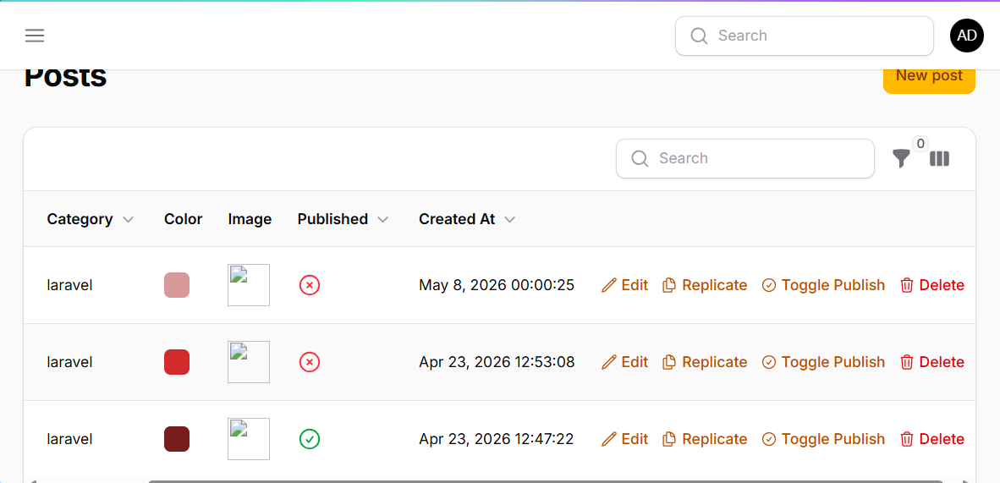

# LAPORAN PRAKTIKUM PERTEMUAN 13
## Implementasi Table Actions & Custom Action di Filament

## Identitas Mahasiswa
**Nama:** Achmad Daud Roichan  
**NIM:** 244107020005  
**Kelas:** TI-2F  
**Semester:** 2026/2027  

---

**Mata Kuliah:** Pemrograman Web Lanjut  
**Pertemuan:** 13  
**Topik:** Implementasi Table Actions & Custom Action di Filament  
**Tanggal Praktikum:** 2026  

---

## Hasil Implementasi (Screenshot)

### Screenshot 1: Tabel Posts dengan Table Actions



## I. CAPAIAN PEMBELAJARAN

Setelah mengikuti praktikum ini, mahasiswa mampu:
- ✅ Menambahkan Record Actions pada tabel Filament
- ✅ Menggunakan predefined actions (Edit, Delete, Replicate)
- ✅ Membuat custom action pada tabel
- ✅ Mengupdate data langsung dari tabel tanpa masuk ke halaman edit
- ✅ Menambahkan label dan icon pada action
- ✅ Memahami konsep callback/action function pada Filament

---

## II. LATAR BELAKANG

Pada tabel Post secara default hanya terdapat tombol Edit. Sedangkan tombol Delete tersedia di halaman edit. Untuk meningkatkan efisiensi, perlu ditambahkan:
- Tombol Delete langsung di tabel
- Tombol Replicate (Copy Data)
- Tombol custom untuk mengubah status Publish/Unpublish

Dengan implementasi ini, user dapat mengelola data dengan lebih efisien tanpa perlu memasuki halaman edit untuk setiap aksi.

---


```
## III. IMPLEMENTASI TABLE ACTIONS

### A. Menambahkan Delete Action

**File:** `app/Filament/Admin/Resources/Posts/Tables/PostsTable.php`

**Kode:**
```php
DeleteAction::make()
    ->icon('heroicon-o-trash')
    ->requiresConfirmation(),
```

**Hasil:**
- ✅ Tombol Delete muncul di tabel
- ✅ Saat diklik muncul confirmation dialog
- ✅ Data terhapus tanpa perlu masuk ke halaman edit

---

### B. Menambahkan Replicate (Copy) Action

**Kode:**
```php
ReplicateAction::make()
    ->icon('heroicon-o-document-duplicate')
    ->label('Replicate'),
```

**Hasil:**
- ✅ Tombol Replicate muncul dengan icon document-duplicate
- ✅ Saat diklik → record baru dibuat dengan data yang sama
- ✅ Slug dan ID akan di-generate secara otomatis

---

### C. Custom Action - Toggle Publish Status

**Kode Lengkap:**
```php
Action::make('status')
    ->label('Toggle Publish')
    ->icon('heroicon-o-check-circle')
    ->color('warning')
    ->schema([
        Checkbox::make('published')
            ->label('Publish this post')
            ->default(fn($record): bool => $record->published),
    ])
    ->action(function ($record, $data) {
        $record->update(['published' => $data['published']]);
    })
    ->requiresConfirmation()
    ->modalHeading('Update Publish Status')
    ->modalDescription('Are you sure you want to change the publish status?')
    ->modalSubmitActionLabel('Update'),
```

**Penjelasan:**
1. **Action::make('status')** - Membuat custom action dengan identifier 'status'
2. **->label('Toggle Publish')** - Menampilkan label pada button
3. **->icon('heroicon-o-check-circle')** - Menambahkan icon check-circle
4. **->color('warning')** - Mengubah warna button menjadi warning (kuning/oranye)
5. **->schema([...])** - Menambahkan form input (Checkbox dalam hal ini)
6. **->action(function ($record, $data) {...})** - Callback untuk menghandle aksi
7. **->requiresConfirmation()** - Menambahkan dialog konfirmasi
8. **->modalHeading()** - Judul dialog
9. **->modalDescription()** - Deskripsi dialog
10. **->modalSubmitActionLabel('Update')** - Label tombol submit

---

## IV. DAFTAR SEMUA ACTIONS YANG DIIMPLEMENTASIKAN

| No | Action | Icon | Fungsi | Confirmation |
|:--:|:------:|:----:|:------:|:----------:|
| 1 | Edit | `heroicon-o-pencil` | Mengedit data | ✗ |
| 2 | Replicate | `heroicon-o-document-duplicate` | Menyalin/menduplikasi data | ✗ |
| 3 | Toggle Publish | `heroicon-o-check-circle` | Mengubah status publish | ✓ |
| 4 | Delete | `heroicon-o-trash` | Menghapus data | ✓ |

---

## V. FITUR-FITUR YANG DIGUNAKAN

### 1. requiresConfirmation()
```php
->requiresConfirmation()
```
Menambahkan dialog konfirmasi sebelum action dieksekusi.

### 2. Icon & Color
```php
->icon('heroicon-o-check-circle')
->color('warning')
```
Menambahkan icon dan mengubah warna action button.

### 3. Schema & Form Input
```php
->schema([
    Checkbox::make('published')
        ->label('Publish this post')
        ->default(fn($record): bool => $record->published),
])
```
Menambahkan form input dalam modal action.

### 4. Action Callback
```php
->action(function ($record, $data) {
    $record->update(['published' => $data['published']]);
})
```
Menghandle logika update data ketika action dieksekusi.

## VII. ANALISIS & DISKUSI

### 1. Mengapa action di tabel lebih efisien dibanding halaman edit?

**Jawaban:**

Action di tabel lebih efisien karena:

- **Kecepatan Akses:** User tidak perlu memasuki halaman edit terpisah, sehingga menghemat waktu loading dan navigasi
- **Workflow yang Cepat:** Untuk aksi sederhana seperti delete atau toggle status, user dapat langsung melakukannya dari tabel tanpa context switching
- **Pengurangan Loading:** Mengurangi request HTTP karena tidak perlu membuka halaman edit lengkap
- **User Experience:** Interface lebih intuitif dan responsif, user dapat melihat perubahan data secara langsung di tabel
- **Mobile-Friendly:** Untuk perangkat mobile, tabel actions lebih praktis dibanding navigasi ke halaman edit
- **Bulk Operations:** Beberapa aksi dapat dilakukan untuk multiple records sekaligus (seperti DeleteBulkAction)

**Contoh Skenario:**
- Edit halaman: User klik post → buka halaman edit → ubah data → simpan → kembali ke tabel (5 step)
- Tabel actions: User klik toggle publish → konfirmasi → simpan (2 step)

---

### 2. Apa perbedaan predefined action dan custom action?

**Jawaban:**

| Aspek | Predefined Action | Custom Action |
|:-----:|:-----------------:|:-------------:|
| **Definisi** | Action bawaan Filament yang sudah siap pakai | Action yang dibuat khusus sesuai kebutuhan bisnis |
| **Contoh** | EditAction, DeleteAction, ReplicateAction | Action toggle status, custom validation, dst |
| **Konfigurasi** | Minimal, hanya perlu import & panggil | Perlu mendefinisikan schema, action callback, logic |
| **Fleksibilitas** | Terbatas pada fitur bawaan | Sangat fleksibel, dapat disesuaikan sepenuhnya |
| **Durasi Development** | Cepat | Lebih lama karena perlu custom logic |
| **Maintenance** | Dihandle oleh Filament framework | Developer yang maintain |

**Contoh Predefined:**
```php
EditAction::make()
ReplicateAction::make()
DeleteAction::make()
```

**Contoh Custom:**
```php
Action::make('status')
    ->schema([...])
    ->action(function ($record, $data) { ... })
```

---

### 3. Bagaimana cara menambahkan validasi dalam custom action?

**Jawaban:**

Validasi dalam custom action dapat ditambahkan melalui:

**A. Validasi pada Schema (Form Level):**
```php
Action::make('status')
    ->schema([
        Checkbox::make('published')
            ->label('Publish this post')
            ->required()
            ->default(fn($record): bool => $record->published),
    ])
    ->action(function ($record, $data) {
        $record->update(['published' => $data['published']]);
    })
```

**B. Validasi dalam Action Callback (Business Logic):**
```php
->action(function ($record, $data) {
    // Validasi: Hanya bisa publish jika title tidak kosong
    if (empty($record->title)) {
        throw new \Exception('Cannot publish post without title');
    }
    
    // Validasi: Status harus berubah dari state sebelumnya
    if ($record->published == $data['published']) {
        throw new \Exception('Status is already ' . ($record->published ? 'published' : 'unpublished'));
    }
    
    $record->update(['published' => $data['published']]);
})
```

**C. Validasi dengan Try-Catch & Notification:**
```php
->action(function ($record, $data) {
    try {
        if (empty($record->title)) {
            throw new \Exception('Title is required');
        }
        
        $record->update(['published' => $data['published']]);
        
        \Filament\Notifications\Notification::make()
            ->title('Success')
            ->body('Post status updated successfully')
            ->success()
            ->send();
    } catch (\Exception $e) {
        \Filament\Notifications\Notification::make()
            ->title('Error')
            ->body($e->getMessage())
            ->danger()
            ->send();
    }
})
```

**D. Validasi dengan Request/Validator:**
```php
use Illuminate\Validation\Validator;

->action(function ($record, $data) {
    $validator = Validator::make($data, [
        'published' => 'required|boolean',
    ]);
    
    if ($validator->fails()) {
        throw new \Exception($validator->errors()->first());
    }
    
    $record->update($data);
})
```

---

### 4. Kapan kita menggunakan Replicate?

**Jawaban:**

Replicate digunakan dalam skenario:

**A. Penggunaan yang Tepat:**

1. **Duplicating Complex Data**
   - Membuat post baru berdasarkan post lama dengan template yang sama
   - Copy artikel dengan struktur yang kompleks
   - Duplicate kategori beserta settingnya

2. **Templating System**
   - User ingin membuat data baru yang mirip dengan data lama
   - Mengurangi repetisi penginputan data yang sama

3. **Backup/Snapshot**
   - Membuat versi baru dari data penting sebelum melakukan perubahan besar
   - Historical record dengan data snapshot

4. **Multi-variant Product**
   - E-commerce: Membuat produk variant baru dari produk existing
   - Copy dengan minimal perubahan pada field tertentu

**B. Kustomisasi Replicate:**

Default Replicate akan meng-copy semua field. Untuk custom:

```php
// Di Model Post.php
protected $fillable = ['title', 'slug', 'content', 'category_id', 'image', 'color', 'tags', 'published'];

// Di PostsResource.php
ReplicateAction::make()
    ->excludeAttributes(['published', 'created_at', 'updated_at'])
    ->icon('heroicon-o-document-duplicate')
    ->label('Replicate')
    ->beforeReplica(function ($record, $replica) {
        $replica->title = $replica->title . ' (Copy)';
        $replica->slug = null; // Reset slug untuk di-generate ulang
    })
```

**C. Contoh Use Case di Project:**

Untuk Post resource:
- User membuat Post "Tutorial Laravel"
- User klik Replicate → Sistem membuat Post baru dengan title "Tutorial Laravel (Copy)"
- Semua konten (content, category, image, tags) ter-copy
- User hanya perlu edit judul dan publish date

**D. Keuntungan Menggunakan Replicate:**

- ✅ **Hemat Waktu:** Tidak perlu input ulang data yang sama
- ✅ **Konsistensi Data:** Template/struktur tetap terjaga
- ✅ **Efisiensi:** Khusus untuk dataset besar atau kompleks
- ✅ **User Friendly:** Mengurangi human error saat input ulang

**E. Kapan TIDAK Menggunakan Replicate:**

- ❌ Data yang benar-benar berbeda (unique records)
- ❌ Ketika hanya ada beberapa field yang ingin di-isi
- ❌ Untuk data yang status/state-nya harus berbeda

---

## VIII. HASIL UJI COBA (Testing Screenshots)

### Test 1: Implementasi Delete Button


**Hasil:** ✅ Delete button berhasil ditampilkan dengan icon trash di setiap baris

---

### Test 2: Implementasi Replicate Button


**Hasil:** ✅ Replicate button berfungsi, data berhasil di-copy dengan ID dan slug baru

---

### Test 3: Custom Status Toggle Action


**Hasil:** ✅ Custom action berfungsi, user dapat toggle publish status dari tabel

---

### Test 4: Confirmation Dialog


**Hasil:** ✅ Dialog konfirmasi muncul untuk mencegah aksi yang tidak disengaja

---

### Test 5: Icon Implementation


**Keterangan Icons:**
- 🖊️ `heroicon-o-pencil` - Edit action
- 📄 `heroicon-o-document-duplicate` - Replicate action  
- ✓ `heroicon-o-check-circle` - Toggle Publish action (warning color)
- 🗑️ `heroicon-o-trash` - Delete action

**Hasil:** ✅ Semua icon berhasil ditampilkan dengan konsisten

---

## IX. KESIMPULAN

Pertemuan ini membahas implementasi Table Actions & Custom Action di Filament dengan hasil:

### ✅ Pencapaian:
1. **Record Actions:** Berhasil mengimplementasikan Edit, Delete, Replicate, dan Custom Status Toggle
2. **Icons & Colors:** Setiap action memiliki icon yang berbeda dan warna yang sesuai
3. **Confirmation Dialog:** Action Delete dan Toggle Status dilengkapi dengan confirmation modal
4. **Custom Logic:** Custom action dengan form input dan update callback berfungsi dengan baik
5. **User Experience:** Interface lebih efisien dan user-friendly

### 📋 Fitur-Fitur yang Diimplementasikan:
- ✅ Delete Action dengan confirmation
- ✅ Replicate Action untuk duplicate data
- ✅ Custom Toggle Publish Action
- ✅ Icon dan color pada setiap action
- ✅ Form input dengan checkbox
- ✅ Modal confirmation dengan pesan yang jelas

### 🎯 Manfaat:
- Meningkatkan efisiensi manajemen data di admin panel
- Mengurangi waktu akses user untuk operasi sederhana
- Memberikan UX yang lebih baik dan responsif
- Memudahkan developer dalam membuat custom business logic

### 🚀 Kemungkinan Pengembangan:
- Menambahkan more custom actions (Export, Archive, Send Email, dst)
- Implement conditional visibility untuk actions
- Membuat action dengan multiple form fields dan validasi kompleks
- Integrate dengan event listener untuk action logging/audit trail

---

## X. REFERENSI

- **Framework:** Filament v3.x
- **Dokumentasi:** https://filamentphp.com/docs/3.x/tables/actions/overview
- **Laravel Version:** 11.x
- **PHP Version:** 8.2+

---

**Dibuat oleh:** Achmad Daud Roichan (244107020005)  
**Tanggal:** 2026  
**Status:** ✅ Selesai

---

## XI. INFORMASI AKUN & CARA MENJALANKAN

### Akun Login
| Keterangan | Nilai |
|:----------:|:-----:|
| **Email** | admin@example.com |
| **Password** | password123 |

atau

| Keterangan | Nilai |
|:----------:|:-----:|
| **Email** | test@filament.local |
| **Password** | Test123456 |

### Cara Menjalankan Server

1. **Buka Terminal/PowerShell**
2. **Navigate ke folder week-13:**
   ```bash
   cd c:\laragon\www\Pemrograman_Web_Lanjut\week-13
   ```

3. **Jalankan Laravel Development Server:**
   ```bash
   php artisan serve
   ```

4. **Buka Browser dan akses:**
   ```
   http://127.0.0.1:8000/admin
   ```

5. **Login menggunakan salah satu akun di atas**

6. **Navigasi ke Posts → Lihat Table Actions**

### File yang Diubah
- ✅ `app/Filament/Admin/Resources/Posts/Tables/PostsTable.php` - Menambahkan DeleteAction, ReplicateAction, dan Custom Status Toggle Action
